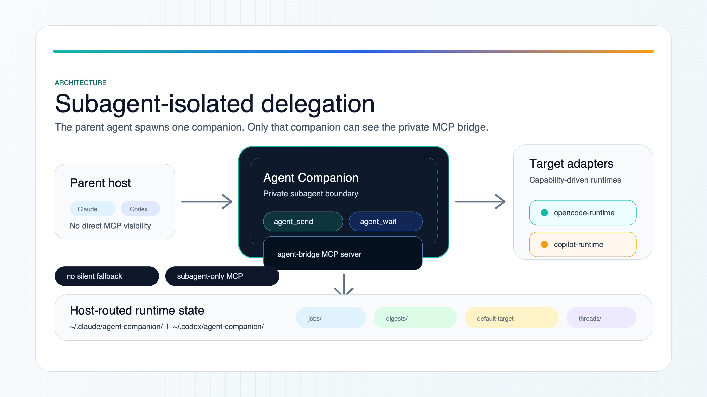
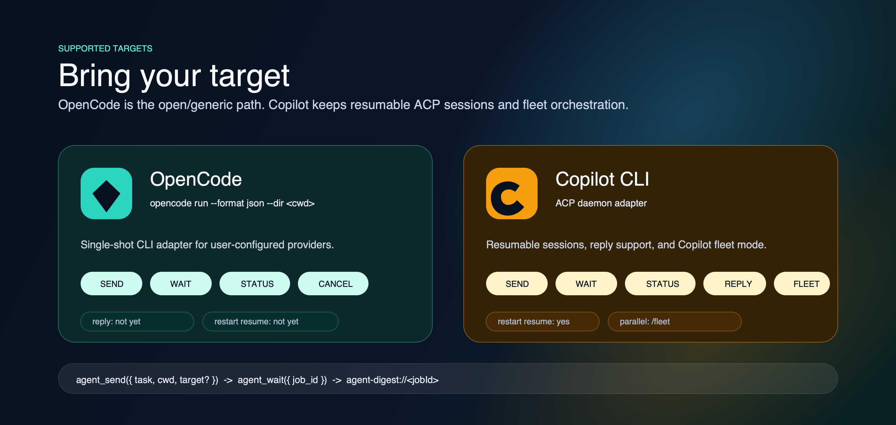

# Agent Companion


Agent Companion is a dual-host delegation plugin for **Claude Code** and
**Codex CLI**. It gives the parent agent one clean move: spawn a private
companion subagent, then let that subagent delegate large implementation,
review, and research work to your chosen target runtime.

The product posture is deliberately target-neutral:

- **Bring your target.** Choose `opencode` or `copilot` on each send, or persist
  one bridge default.
- **Keep the parent clean.** Main Claude and main Codex never see the bridge MCP
  server directly.
- **Use one public surface.** The subagent owns the generic `agent_*` tools:
  `agent_send`, `agent_wait`, `agent_status`, `agent_reply`, and
  `agent_cancel`.
- **Avoid silent behavior.** If no target is passed or configured,
  `agent_send` returns `TARGET_UNCONFIGURED` with onboarding guidance.

Current implementation status lives in [docs/MVP_TRACKER.md](docs/MVP_TRACKER.md).
Architecture details live in [docs/ARCHITECTURE.md](docs/ARCHITECTURE.md).
The delivered onboarding design record lives in
[docs/ONBOARDING_HANDOFF.md](docs/ONBOARDING_HANDOFF.md).

## What It Does

Agent Companion turns a natural-language delegation request into a background
job owned by an isolated subagent:

1. The parent host decides to spawn the `agent-companion` subagent.
2. The subagent calls its private `agent-bridge` MCP server.
3. The bridge resolves the selected target, creates a job, and returns quickly.
4. The target runtime runs the work in the requested `cwd`.
5. The bridge writes progress digests and emits one terminal completion event.
6. The subagent reports the result back to the parent.

That means token-heavy work can happen outside the parent's main context while
still giving the parent a structured result, status checks, cancellation, and
digest links.



## Supported Targets



| Target | Runtime | Send | Wait | Status | Cancel | Reply | Restart resume |
| --- | --- | --- | --- | --- | --- | --- | --- |
| OpenCode | `opencode run --format json --dir <cwd>` | yes | yes | yes | yes | no | no |
| GitHub Copilot CLI | ACP daemon path | yes | yes | yes | yes | yes | yes, with ACP |

Notes:

- OpenCode is a single-shot CLI adapter in the MVP. Reply/re-steer and restart
  resume require a future server or ACP adapter.
- Copilot keeps `/fleet` parallel orchestration. `parallel: "auto"` can prepend
  `/fleet` for broad Copilot tasks; OpenCode remains single-shot.
- Goose and Aider are tracked as future adapter candidates.

## Requirements

- Node.js `>= 22`.
- `npm`.
- `jq` for hook delivery.
- At least one target runtime:
  - OpenCode on `PATH`, or `OPENCODE_BIN=/absolute/path/to/opencode`.
  - GitHub Copilot CLI on `PATH`, or `COPILOT_BIN=/absolute/path/to/copilot`.
- Claude Code CLI when installing the Claude surface.
- Codex CLI when installing the Codex surface.

OpenCode authentication and provider setup stays inside OpenCode. Copilot
authentication stays inside Copilot CLI. Agent Companion does not ask for or
store provider secrets.

## Fast Path

From the repository root, pick the host surface you actually use:

```bash
# Codex source-checkout install, without selecting a default target yet.
bash setup.sh --host codex --target none

# Or Claude source-checkout install, without selecting a default target yet.
bash setup.sh --host claude --target none

# See target readiness and next steps.
node scripts/onboard.mjs --list-targets

# Persist a default target for Codex state.
AGENT_COMPANION_HOST=codex node scripts/onboard.mjs --target opencode --set-default

# Or persist a default target for Claude state.
AGENT_COMPANION_HOST=claude node scripts/onboard.mjs --target opencode --set-default
```

For a narrower install:

```bash
# Codex only, OpenCode default.
bash setup.sh --host codex --target opencode

# Claude only, Copilot default.
bash setup.sh --host claude --target copilot

# Host/plugin surface only. Every send must pass target explicitly.
bash setup.sh --host both --target none
```

`setup.sh --host both --target auto` selects the only ready target for both
hosts. If multiple targets are ready, pass the target explicitly.

## Onboarding Commands

```bash
node scripts/onboard.mjs --list-targets
node scripts/onboard.mjs --doctor
node scripts/onboard.mjs --target opencode --set-default
node scripts/onboard.mjs --target copilot --set-default
node scripts/onboard.mjs --target opencode --smoke
```

Useful flags:

| Flag | Purpose |
| --- | --- |
| `--host` | Label/scope onboarding output as `claude`, `codex`, or `both`. |
| `--target` | Select `opencode`, `copilot`, `auto`, or `none`. |
| `--set-default` | Write `~/.{claude,codex}/agent-companion/default-target`. |
| `--json` | Emit machine-readable reports. |
| `--no-target-check` | Persist the target even if readiness checks fail. |
| `--smoke` | Run an opt-in target smoke task when supported. |

For standalone host-specific writes, set `AGENT_COMPANION_HOST=codex` or
`AGENT_COMPANION_HOST=claude` on the command. `setup.sh` does this for each
host when it delegates to onboarding.

`AGENT_COMPANION_DEFAULT_TARGET` overrides the persisted default. If neither is
set and `agent_send` omits `target`, the bridge refuses the send instead of
guessing.

## Install For Claude Code

This repo is its own local marketplace. Register it once, then install the
plugin:

```bash
claude plugin marketplace add /path/to/agent-companion
claude plugin install agent-companion@agent-companion
```

For fastest source iteration:

```bash
claude --plugin-dir /path/to/agent-companion
```

Claude plugin-bundled subagents ignore `mcpServers`, `hooks`, and
`permissionMode` frontmatter for security. Agent Companion handles that by
materializing `templates/agent-companion.md` to:

```text
~/.claude/agents/agent-companion.md
```

The standalone materialized agent owns the private MCP bridge.

### Claude Permissions

The subagent needs permission to call the split MCP tools. Source checkout setup
does this idempotently:

```bash
node scripts/install-permissions.mjs --host claude --yes
```

Marketplace installs can also approve the first prompt with "Yes, don't ask
again". The allow-list shape is:

```json
{
  "permissions": {
    "allow": [
      "mcp__agent-bridge__agent_send",
      "mcp__agent-bridge__agent_wait",
      "mcp__agent-bridge__agent_status",
      "mcp__agent-bridge__agent_reply",
      "mcp__agent-bridge__agent_cancel",
      "Bash(echo \"$CLAUDE_CODE_SESSION_ID\")"
    ]
  }
}
```

Use `.claude/settings.local.json` if you want these permissions scoped to one
repository.

Claude thread continuity also requires:

```bash
export CLAUDE_CODE_EXPERIMENTAL_AGENT_TEAMS=1
```

`setup.sh --host claude` appends that export to `~/.zshrc` when missing.

## Install For Codex CLI

Build a local Codex marketplace package:

```bash
node scripts/build-codex-marketplace.mjs --out dist/codex-marketplace
codex plugin marketplace add dist/codex-marketplace
codex plugin add agent-companion@agent-companion --json
```

Validate the package end to end in an isolated `CODEX_HOME`:

```bash
node scripts/validate-codex-release.mjs
```

The generated package uses plugin-scoped Codex hooks from
`hooks/hooks-codex.json`; it does not mutate live `~/.codex/hooks.json`.

For source-checkout development:

```bash
bash setup.sh --host codex
```

That path materializes:

```text
~/.codex/agents/agent-companion.toml
```

and merges managed dev hook entries into `~/.codex/hooks.json`. Managed entries
carry `_managed_by: "agent-companion"` and can be removed with:

```bash
node scripts/install-codex-hooks.mjs --plugin-root "$(pwd)" --uninstall --yes
```

Codex V1 `multi_agent` surfaces the terminal subagent message on the next parent
turn. If a job has finished and main Codex has not resumed, send a short prompt
such as `any updates?`.

## Internal MCP Surface

You normally do not call these tools yourself. The host reads the subagent
description and spawns it when you ask for delegation, status, reply, or cancel.

```text
agent_send({
  task,
  cwd,
  target?,
  mode?,
  template?,
  template_args?,
  thread?,
  max_wait_sec?,
  parallel?
})

agent_wait({ job_id, max_wait_sec? })
agent_status({ job_id?, verbose?, diagnostics? })
agent_reply({ job_id, message })
agent_cancel({ job_id })
```

Important rules:

- `cwd` is required on every send and must be an absolute target repo/worktree
  path.
- `target` may be `opencode` or `copilot`. If omitted, resolution checks
  `AGENT_COMPANION_DEFAULT_TARGET`, then the host state file.
- `agent_send` returns `still_running` immediately with a `job_id`.
- `agent_wait` blocks in bounded intervals. The max wait is 1200 seconds.
- `agent_status({ diagnostics: true })` embeds the same environment report as
  `node scripts/doctor.mjs --json`.

Terminal statuses are `completed`, `failed`, `cancelled`, `stuck`, `timeout`,
and `unreachable`.

## Templates, Modes, And Parallelism

Templates:

| Template | Purpose |
| --- | --- |
| `general` | Default implementation, review, and analysis work. |
| `research` | Multi-source research. |
| `plan_review` | Plan verification with a required `plan_path`. |

General modes:

| Mode | Purpose |
| --- | --- |
| `EXECUTE` | Implement or carry out the requested task. |
| `PLAN` | Produce a plan without changing code. |
| `ANALYZE` | Diagnose or review without implementation. |

Parallelism:

```jsonc
agent_send({ task: "audit auth, billing, and API routes", target: "copilot", parallel: "always" })
agent_send({ task: "fix the typo in src/foo.ts", target: "opencode", parallel: "never" })
```

`parallel: "auto"` is the default. It can use Copilot `/fleet` only for broad
Copilot tasks.

## Runtime State And Digests

Per-host state lives under:

```text
~/.claude/agent-companion/
~/.codex/agent-companion/
```

Runtime files live under each host's `runtime/` directory:

```text
copilot-acp.sock
agent-bridge.log
copilot-acp-daemon.log
prompts/copilot-acp-<promptId>.jsonl
digests/agent-digest-<jobId>.md
completions.jsonl
```

The bridge surfaces progress as:

```text
agent-digest://<jobId>
```

Digests include the task, final or partial assistant output, target output,
tool-call summaries, files touched, and latest todo snapshots when available.
The MCP resource is the canonical way for the parent to inspect progress
without another raw filesystem read.

## Diagnostics

```bash
node scripts/doctor.mjs
node scripts/doctor.mjs --json
node scripts/onboard.mjs --doctor
node scripts/onboard.mjs --list-targets
```

Install markers:

```bash
cat ~/.claude/agent-companion/.host
cat ~/.codex/agent-companion/.host
```

Bridge startup events are JSONL:

```bash
grep '"event":"bridge.startup"' ~/.claude/agent-companion/daemon.log
grep '"event":"bridge.startup"' ~/.codex/agent-companion/daemon.log
```

## Development

Run the project checks locally:

```bash
bash -n setup.sh hooks/*.sh
find bridge-server lib scripts hooks templates -path '*/node_modules' -prune -o -type f -name '*.mjs' -print0 | xargs -0 -n1 node --check
node --test --experimental-test-coverage $(find bridge-server lib scripts hooks templates -path '*/node_modules' -prune -o -type f -name '*.test.mjs' -print)
```

Package validation:

```bash
node scripts/build-codex-marketplace.mjs --out dist/codex-marketplace
node scripts/validate-codex-release.mjs
claude plugin validate .
```

## Design Invariants

- The `agent-bridge` MCP server is subagent-only.
- Main Claude and main Codex never call the bridge directly.
- The bridge is spawned per invocation; there is no activation lifecycle.
- Sends are non-blocking and waits are bounded.
- Orphan completions are stored in `completions.jsonl` and drained by hooks.
- Model choice is configuration, not a public tool parameter.
- Node dependencies persist under plugin data; bundled source updates with the
  plugin package.

## Not Supported

- Direct parent-agent calls to the bridge.
- Slash commands or skills as the public surface.
- Session opt-in or pause.
- OpenCode in-flight reply/re-steer.
- OpenCode restart resume.
- MCP elicitation or `NEEDS_USER_INPUT` flows.

## Repository Map

```text
.claude-plugin/        Claude plugin manifest and local marketplace manifest
.codex-plugin/         Codex plugin manifest
assets/readme/         README PNG assets plus editable SVG diagram sources
bridge-server/         MCP server plus target runtime adapters
docs/                  Architecture, tracker, and onboarding handoff
hooks/                 Claude and Codex lifecycle hooks
lib/                   Shared state, host routing, diagnostics, prompt helpers
scripts/               Setup, onboarding, marketplace build, release validation
templates/             Claude Markdown and Codex TOML subagent templates
setup.sh               Host install and target onboarding entry point
```

## License

MIT. See [LICENSE](LICENSE).
