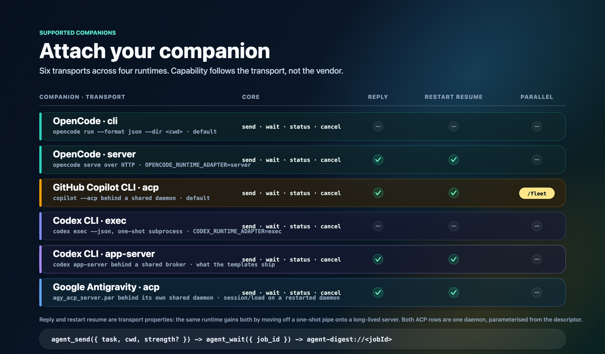

# Agent Companion


Agent Companion is a delegation plugin for coding agents built around one
public contract:

> Come with any harness and attach any companion of your choice to it.

A **harness** is the parent coding-agent surface you already work in. Supported
now: **Claude Code** and **Codex CLI**.

A **companion** is the downstream agent runtime that receives delegated work.
Supported now: **OpenCode**, **GitHub Copilot CLI**, **Codex CLI** and **Google
Antigravity** (Codex CLI can be both the harness and a downstream companion — the two roles are
independent; running Codex as a companion does not require Codex as the harness,
or vice versa).

Routing is one-to-many: connect multiple companion profiles at once, give each
profile strengths, and let the harness ask for a strength instead of a concrete
runtime. A send may name a strength, a configured profile, or a bare companion;
the bridge resolves it to exactly one companion profile.

The product posture is deliberately companion-neutral:

- **Bring your harness.** Install the Claude Code surface, the Codex CLI surface,
  or both.
- **Attach your companion.** Choose `opencode`, `copilot`, `codex` or `antigravity` on each
  send, route by strength or profile, or persist one bridge default.
- **Keep the parent workflow clean.** Delegated work runs through the isolated
  subagent. Claude scopes the bridge to that agent; Codex must register the
  internal bridge at plugin/session scope so the role can inherit it, but the
  subagent remains its only supported caller.
- **Use one public surface.** The subagent owns the generic `agent_*` tools:
  `agent_send`, `agent_wait`, `agent_status`, `agent_reply`, and
  `agent_cancel`.
- **Avoid silent behavior.** If a send selects nothing and nothing is
  configured, `agent_send` returns `TARGET_UNCONFIGURED` with onboarding
  guidance; an unresolvable profile or strength gets its own named error.
- **Route by strengths.** Companion profiles advertise strengths such as
  `reviewer` or `web_researcher`; harnesses request the strength and never
  hard-code a vendor/runtime choice.

Implementation note: today the CLI and MCP schema still use `host` for harness
selection and `target` for companion selection. Those names are stable public
flags for the MVP.

Current implementation status lives in [docs/MVP_TRACKER.md](docs/MVP_TRACKER.md).
Architecture details live in [docs/ARCHITECTURE.md](docs/ARCHITECTURE.md).
Public release gates live in [docs/RELEASE_READINESS.md](docs/RELEASE_READINESS.md).
The delivered onboarding design record lives in
[docs/ONBOARDING_HANDOFF.md](docs/ONBOARDING_HANDOFF.md).

## What It Does

Agent Companion turns a natural-language delegation request into a background
job owned by an isolated subagent:

1. The parent harness decides to spawn the `agent-companion` subagent.
2. The subagent calls the internal `agent-bridge` MCP server (agent-local on
   Claude, inherited from the installed plugin on Codex).
3. The bridge resolves the selected companion, creates a job, and returns
   quickly.
4. The companion runtime runs the work in the requested `cwd`.
5. The bridge writes progress digests and emits one terminal completion event.
6. The subagent reports the result back to the harness.

That means token-heavy work can happen outside the parent's main context while
still giving the parent a structured result, status checks, cancellation, and
digest links.


## Supported Harnesses

| Harness | Install selector | Status |
| --- | --- | --- |
| Claude Code | `--host claude` | implemented |
| Codex CLI | `--host codex` | implemented |

Future harnesses should add a host install surface, subagent template, hook or
completion delivery path, and session-routing adapter without changing the
companion runtime boundary.

## Supported Companions



| Companion | Runtime | Send | Wait | Status | Cancel | Reply | Restart resume |
| --- | --- | --- | --- | --- | --- | --- | --- |
| OpenCode (cli, default) | `opencode run --format json --dir <cwd>` | yes | yes | yes | yes | no | no |
| OpenCode (server) | `opencode serve` over HTTP | yes | yes | yes | yes | yes | yes |
| GitHub Copilot CLI | `copilot --acp` behind the shared ACP daemon | yes | yes | yes | yes | yes (cancel + re-prompt) | yes, with ACP |
| Codex CLI (exec) | `codex exec --json` (one-shot subprocess) | yes | yes | yes | yes | no | no |
| Codex CLI (app-server, what the templates ship) | `codex app-server` behind a shared broker | yes | yes | yes | yes | yes | yes |
| Google Antigravity | `agy_acp_server.par` (Google's ACP-registry server) behind the shared ACP daemon | yes | yes | yes | yes | yes (cancel + re-prompt) | yes, with ACP and `session/load` |

Notes:

- OpenCode ships two adapters, selected by `OPENCODE_RUNTIME_ADAPTER`:
  - `cli` (default) is the single-shot `opencode run` adapter.
  - `server` drives a long-lived `opencode serve` HTTP server and adds in-flight
    reply/re-steer, restart resume, and streamed event digests. One shared server
    roots each job at its own `cwd` via the `?directory=` query param. The server
    is detached and survives bridge restarts (like the Copilot daemon) so a
    respawned bridge reattaches instead of re-spawning.
  - Server-mode binds `127.0.0.1` and is unsecured; permission handling follows
    OpenCode's own config (the `AGENT_COMPANION_OPENCODE_PERMISSION_MODE=skip`
    flag applies to the cli adapter only). Job timeout defaults to 40 minutes,
    override with `AGENT_COMPANION_OPENCODE_TIMEOUT_MS`; in server mode the
    shared server's idle TTL is derived from it rather than set directly.
  - `AGENT_COMPANION_OPENCODE_MODEL=provider/model` pins a model. In server mode
    it is the fallback for any job whose profile pins none; on `cli` it reaches
    the job as the synthesized default profile's model. A profile's own `model`
    wins either way, and unset leaves OpenCode's configured default in place.
- Copilot keeps `/fleet` parallel orchestration. `parallel: "auto"` can prepend
  `/fleet` for broad Copilot tasks; OpenCode, Codex and Antigravity remain single-job.
- The two ACP companions share one daemon implementation,
  `scripts/acp-daemon.mjs`, run as one detached process **per companion** per
  host home (`--companion copilot|antigravity`), each with its own socket, log
  and prompt streams and an
  entry in `runtime/acp-daemons.json` with leases and a two-phase disposal
  claim — the codex broker's shape. Everything companion-shaped is the
  descriptor's `acp` block in `lib/target-registry.mjs`: the spawn argv, extra
  env, `clientInfo.name`, the default model, whether `session/load` is
  honoured, the answer to `session/request_permission`, the usage reader, the
  `session/update` kinds the agent was measured to emit and, where the agent
  takes its model per session rather than as a flag, the request that sets it.
  So a native ACP agent is a descriptor plus an install/auth block, not a
  daemon — Antigravity is one.
  The daemon pins ACP **v1**; an agent answering another version is refused
  (`ACP_PROTOCOL_MISMATCH`, the job settles `unreachable`), never adapted. It
  answers `session/request_permission` itself, from the descriptor's policy,
  so an agent that asks is never left hanging. Reply on an ACP companion is a
  cancelled turn plus a new prompt on the same session, told why — ACP has no
  mid-turn steer and the acknowledgement says so.
- Google Antigravity (`agy_acp_server.par` 1.1.1, measured 2026-09-11):
  - The daemon spawns **Google's own ACP server** from the ACP registry
    (`antigravity-acp` — the binary Zed, JetBrains and Xcode launch), never the
    `agy` CLI, which has no ACP mode (cask 1.2.0; antigravity-cli#31 is open).
    Install it with `node scripts/install-antigravity-acp.mjs` (reads the
    registry, downloads the platform archive, verifies the Google LLC
    Developer ID signature on macOS, unpacks under
    `~/.local/share/agent-companion/antigravity-acp/<version>/`); override the
    path with `ANTIGRAVITY_ACP_BIN`.
  - Sign in with `node scripts/install-antigravity-acp.mjs --login`: the
    server prints a Google sign-in URL and opens the browser (any Antigravity
    plan, including the free tier, or `--method gemini-api-key` with
    `GEMINI_API_KEY`). Credentials are the server's own — `auth.type` in
    `~/.gemini/antigravity-acp/settings.json`, the token in the login
    keychain — shared with neither `agy` nor Gemini CLI; `node
    scripts/onboard.mjs --list-targets` reads that state without a turn.
  - Terms: the bridge is a stdio client of Google's signed server, exactly
    what the editors Google documents are. It never holds the OAuth token and
    never calls Google's backend, which is the conduct the Antigravity terms
    and FAQ prohibit ("third party software, tools, or services to access the
    Service (e.g. using OpenClaw with Antigravity OAuth)"). The reading, its
    quotes and its caveats are `docs/MVP_TRACKER.md` item 8; the account risk
    is yours. On the free tier Google staff may review your Interactions
    unless the account opts out in Antigravity's own settings.
  - Permissions: the daemon is the user. The server asks
    `session/request_permission` for `execute` and `edit` tool calls in its
    default mode and never for reads; `AGENT_COMPANION_ANTIGRAVITY_PERMISSION=
    all|edit|none` (default `all`) is the daemon's answer (allow everything /
    allow edits only / allow nothing that asks — a rejected tool tells the
    model). The tool sandbox is derived from the session `cwd` with symlinks
    resolved, so `cwd` must be the real project directory.
  - A profile `model` (`gemini-3.7-flash-high`, `gemini-3.8-flash-low`,
    `gemini-pro-agent`, …) is a per-session config option the server
    validates itself (an unknown id fails the job, naming the available ones);
    unset leaves the account's default. A session the daemon no longer holds
    is `session/load`ed — the server keeps sessions on disk and a loaded one
    remembers — and told its model again, because a loaded session comes
    back on the default.
  - Usage: none. The ACP surface carries no usage (the prompt response is
    `{stopReason}` only, no `usage_update`), so Antigravity jobs have no
    `usage` key. No `/fleet`, no rubber-duck wrapper: output is relay-only.
- Codex ships two adapters, selected by `CODEX_RUNTIME_ADAPTER`:
  - `exec` is the single-shot `codex exec --json` adapter — the *code* default,
    but not what you get: both agent templates set
    `CODEX_RUNTIME_ADAPTER=appserver` in the bridge's MCP `env`, so a real
    install runs the app-server row above. Select it explicitly with
    `CODEX_RUNTIME_ADAPTER=exec`. It is
    send-only: that pipe has no live control channel and leaves no daemon to
    reattach to after a bridge restart. The limit is the **transport**, not codex.
  - `appserver` talks JSON-RPC to a shared broker that owns one long-lived
    `codex app-server`, and adds in-flight reply (`turn/steer` injects into the
    running turn — nothing is cancelled and no work is discarded), restart
    resume (`thread/resume` rejoins a *running* thread; if the broker itself
    died, the rollout on disk still yields the transcript and only the in-flight
    turn is lost) and real sub-turn streamed digests. Cancel becomes
    `turn/interrupt`, which ends the turn and leaves the thread live. A
    follow-up send on the same `thread` resumes the codex thread the last job
    on it recorded (its id is the thread's `.sid`, exactly as Copilot's ACP
    session id is), so the conversation continues instead of restarting cold.
    A thread name with no recorded id is what opens fresh — note that omitting
    `thread` on a host session that already has a thread mapped continues that
    thread, as it always has for Copilot. A
    recorded id that no longer resumes on a healthy broker fails that send
    explicitly and retires the sid — there is no silent fallback to a fresh
    thread.
  - Under `appserver` the approval policy is pinned to `never` and is not
    configurable: a client that accepts one approval escalates past the sandbox
    (measured), so the sandbox stays the hard boundary. The broker is detached
    and shared by every bridge on the machine that resolves to the same host
    home — its socket lives under `~/.{claude,codex}/agent-companion/runtime/`,
    so the two harnesses get one broker each — and it is reaped once it has been
    idle with no live job on that host. A loaded completed thread is history,
    not activity: both reapers read the thread state and refuse to stop only for
    an active turn or a state they cannot prove idle.
  - Before starting or reusing that broker, the bridge inspects Codex as an
    executable pair. `CODEX_BIN` (or `codex` on `PATH`) remains the desired
    installed version; the inspector retains its invoked and canonical paths,
    version and file identity, and requires an executable
    `codex-code-mode-host` from the package resources, canonical binary
    directory, or final invoked-directory fallback. If that pair is incomplete
    or its parent is quarantined, a complete, same-version, unquarantined pair
    under `$CODEX_HOME/plugins/.plugin-appserver/` (default
    `~/.codex/plugins/.plugin-appserver/`) is preferred. A complete quarantined
    configured pair remains usable with an advisory when no such fallback is
    available. A failed xattr probe is reported as indeterminate, never silently
    treated as “not quarantined.” Agent Companion creates no helper symlink and
    removes no xattr.
  - Every send compares the running app-server's path, version and file identity
    with the pair a fresh broker would select. A stale broker is replaced only
    after the client, lease and active-turn guards all prove it idle; otherwise
    replacement is deferred rather than risking live work. A dead-broker or
    configuration-`EPERM` failure during `thread/start` gets one guarded restart
    and one retry, never a retry loop.
- Both codex adapters resolve the sandbox mode and network flag the same way,
    with one exception: `bypass` is an exec-only escape hatch. On `exec` it
    swaps `--sandbox` for `--dangerously-bypass-approvals-and-sandbox`, removing
    the sandbox; on `appserver` there is no such flag, so it collapses onto
    `danger-full-access`, which is still a sandbox. Sandbox defaults to
  `workspace-write` with network **ON** by default — the inverse of codex's own
  `codex exec` default (network OFF) — because a companion that can't `npm
  install` fails tasks confusingly; opt out per job with
  `AGENT_COMPANION_CODEX_NETWORK=off`. Override the sandbox mode with
  `AGENT_COMPANION_CODEX_SANDBOX_MODE=read-only|workspace-write|danger-full-access|bypass`
  (`danger-full-access` and `bypass` are both dangerous and flagged as such;
  `bypass` exists for environments that already sandbox the bridge itself,
  since macOS Seatbelt sandboxes do not nest). `.git`/`.codex`/`.agents` stay
  read-only inside the workspace even under `workspace-write` (a carve-out that
  wins over any extra writable roots); jobs that must write git internals need
  `danger-full-access` or `bypass`. Every delegated job persists a full rollout
  transcript under `$CODEX_HOME/sessions` (default `~/.codex/sessions`) with no
  auto-cleanup in v1 — that rollout is what `appserver` recovery reads back
  (`thread/resume` re-loads a thread from it even after the broker dies). The
  `codex exec resume <thread_id>` lever this once anticipated was dropped when
  the app-server transport landed; see
  [docs/RELIABILITY_REMEDIATION.md](docs/RELIABILITY_REMEDIATION.md) "Wave 3".
  Codex inherits the user's own `~/.codex/config.toml` by default (no
  `--ignore-user-config` for real jobs): every enabled MCP server
  boots on each spawn and can stall the first turn up to its configured
  `startup_timeout_sec`, and shell env is inherited into the child minus
  `*KEY*`/`*SECRET*`/`*TOKEN*` names. Optional model pin for the default
  profile: `AGENT_COMPANION_CODEX_MODEL=<model id>` (a profile's own `model`
  wins); timeout default 40 minutes, override with
  `AGENT_COMPANION_CODEX_TIMEOUT_MS`.
- Gemini CLI was built on the generic daemon and dropped before shipping on
  2026-09-11 (Google closed "Login with Google" for individual accounts on
  2026-06-18); Google's own ACP server for Antigravity took its place as the
  second ACP companion the same day — `docs/MVP_TRACKER.md` items 7 and 8 keep
  the evidence. Goose is an ACP row; Aider was dropped (stalled, no ACP or MCP).

## Strength Routing

Shipped 2026-06-23. `resolveRouting` is the bridge's only routing brain, and it
never falls back silently: every request it cannot resolve comes back as a named
error. Ambiguity and unknown-key errors echo the candidate ids; the
capability-gate refusals (`TARGET_UNSUPPORTED`, `CAPABILITY_UNAVAILABLE`,
`MODEL_NOT_ALLOWED`) name the offending companion in `target` instead. Every
envelope carries the public `targets` and `profiles` lists.

One `agent_send` resolves to exactly one companion profile. A send may carry:

| Field | Meaning |
| --- | --- |
| `strength` | Preferred. Route to the configured profile that declares this label. |
| `profile` | A specific configured profile id. Mutually exclusive with `strength`. |
| `target` | A bare companion: `opencode`, `copilot`, `codex`, or `antigravity`. |
| *(none)* | The configured default profile wins — see Internal MCP Surface for the full zero-input order. |

Passing both `strength` and `profile` is `ROUTING_CONFLICT`. A `target` passed
*alongside* one of them is read as an assertion, not a selector: if it disagrees
with the resolved profile's companion, that is `ROUTING_CONFLICT` too.

A profile pins one companion, optionally a model and an adapter, and declares
strengths drawn from a closed vocabulary: `reviewer`, `web_researcher`,
`planner`, `fast_executor`. Profiles inherit capabilities from their companion
and never re-declare them. Author them with onboarding:

```bash
node scripts/onboard.mjs --define-profile copilot_claude_sonnet_4_6 \
  --companion copilot --model claude-sonnet-4.6 --strength web_researcher
node scripts/onboard.mjs --define-profile copilot_gpt_5_4 \
  --companion copilot --model gpt-5.4 --strength reviewer
node scripts/onboard.mjs --define-profile opencode_provider_model \
  --companion opencode --model provider/model --strength fast_executor
node scripts/onboard.mjs --set-default-profile copilot_gpt_5_4
```

Ambiguity is an error rather than a coin flip. When several profiles declare the
same strength — or several target the same bare companion — the configured
`defaultProfile` breaks the tie only when it is itself one of the candidates —
it has to declare that strength, or target that companion. Otherwise the send
fails `STRENGTH_AMBIGUOUS` or `PROFILE_AMBIGUOUS`. With no `profiles.json` at all the
bridge synthesizes a single profile from `default-target`, so an install that
never authored a profile routes exactly as it did before.

Two open items:

- `STRENGTH_CAPABILITY_REQUIREMENTS` ships empty: no strength yet demands a
  capability, so the pre-spawn capability gate is fully wired but inert.
- A profile's `adapter` field is a capability *declaration*. The transport a job
  actually starts on is still whatever `OPENCODE_RUNTIME_ADAPTER` /
  `CODEX_RUNTIME_ADAPTER` says at spawn, frozen per job from there.

## Requirements

- Node.js `>= 22`.
- `npm`.
- `jq` for hook delivery.
- At least one companion runtime:
  - OpenCode on `PATH`, or `OPENCODE_BIN=/absolute/path/to/opencode`.
  - GitHub Copilot CLI on `PATH`, or `COPILOT_BIN=/absolute/path/to/copilot`.
  - Google's Antigravity ACP server, installed by
    `node scripts/install-antigravity-acp.mjs` (or
    `ANTIGRAVITY_ACP_BIN=/absolute/path/to/agy_acp_server.par`) and signed in
    with `--login`.
  - Codex CLI on `PATH`, or `CODEX_BIN=/absolute/path/to/codex`, authenticated
    via `codex login` (ChatGPT plan) or an API key.
- Claude Code CLI when installing the Claude surface.
- Codex CLI when installing the Codex surface.

OpenCode authentication and provider setup stays inside OpenCode. Copilot
authentication stays inside Copilot CLI. Codex authentication stays inside
Codex CLI. Antigravity authentication stays inside Google's ACP server and
the login keychain. Agent Companion does not ask for or store provider secrets.

## Fast Path

From the repository root, pick the harness surface you actually use:

```bash
# Codex source-checkout install, without selecting a default target yet.
bash setup.sh --host codex --target none

# Or Claude source-checkout install, without selecting a default target yet.
bash setup.sh --host claude --target none

# See target readiness and next steps.
node scripts/onboard.mjs --list-targets

# Persist a default target for Codex state.
AGENT_COMPANION_HOST=codex node scripts/onboard.mjs --target opencode --set-default

# Or persist a default target for Claude state.
AGENT_COMPANION_HOST=claude node scripts/onboard.mjs --target opencode --set-default
```

For a narrower install:

```bash
# Codex only, OpenCode default.
bash setup.sh --host codex --target opencode

# Claude only, Copilot default.
bash setup.sh --host claude --target copilot

# Harness/plugin surface only. Every send must select a companion explicitly.
bash setup.sh --host both --target none
```

`setup.sh --host both --target auto` selects the only ready target for both
hosts. If multiple targets are ready, pass the target explicitly.

## Onboarding Commands

Targets:

```bash
node scripts/onboard.mjs --list-targets
node scripts/onboard.mjs --doctor
node scripts/onboard.mjs --target opencode --set-default
node scripts/onboard.mjs --target copilot --set-default
node scripts/onboard.mjs --target codex --set-default
node scripts/onboard.mjs --target antigravity --set-default
node scripts/onboard.mjs --target opencode --smoke
```

Companion profiles (ids, models and strength labels only — never secrets):

```bash
node scripts/onboard.mjs --list-profiles
node scripts/onboard.mjs --define-profile <id> --companion opencode|copilot|codex \
  [--model <m>] [--adapter <transport>] [--strength <labels>]
node scripts/onboard.mjs --assign-strength <id> --strength <labels>
node scripts/onboard.mjs --set-default-profile <id>
```

`--adapter` takes `cli|server` for OpenCode and `exec|appserver` for Codex.
Copilot and Antigravity have no profile-selectable adapter; the ACP daemon is
their one transport.
`--strength` takes a comma-separated subset of `reviewer`, `web_researcher`,
`planner`, `fast_executor`.

Useful flags:

| Flag | Purpose |
| --- | --- |
| `--host` | Label/scope onboarding output as `claude`, `codex`, or `both`. |
| `--target` | Select `opencode`, `copilot`, `codex`, `antigravity`, `auto`, or `none`. |
| `--set-default` | Write `~/.{claude,codex}/agent-companion/default-target`. |
| `--json` | Emit machine-readable reports. |
| `--no-target-check` | Persist the target even if readiness checks fail. |
| `--smoke` | Run an opt-in target smoke task when supported. |
| `--yes` / `-y` | Strict non-interactive mode: skip the smoke confirmation, and fail rather than prompt on an ambiguous target or warn on a strength conflict. |

For standalone host-specific writes, set `AGENT_COMPANION_HOST=codex` or
`AGENT_COMPANION_HOST=claude` on the command. `setup.sh` does this for each
host when it delegates to onboarding.

`AGENT_COMPANION_DEFAULT_PROFILE` overrides the persisted `defaultProfile`, and
`AGENT_COMPANION_DEFAULT_TARGET` overrides the persisted `default-target`. The
default profile is consulted first; `default-target` answers only when no
default profile is configured. With nothing configured at all and `agent_send`
omitting `target`, the bridge refuses the send instead of guessing.

## Install For Claude Code

This repo is its own local marketplace. Register it once, then install the
plugin:

```bash
claude plugin marketplace add /path/to/agent-companion
claude plugin install agent-companion@agent-companion
```

For fastest source iteration:

```bash
claude --plugin-dir /path/to/agent-companion
```

Claude plugin-bundled subagents ignore `mcpServers`, `hooks`, and
`permissionMode` frontmatter for security. Agent Companion handles that by
materializing `templates/agent-companion.md` to:

```text
~/.claude/agents/agent-companion.md
```

The standalone materialized Claude agent owns its private MCP bridge.

The MCP call deadline is set per host, on the server entry itself:
`timeout: 1320000` (milliseconds) in the Claude frontmatter, `tool_timeout_sec =
1320` in the Codex plugin manifest. Both clear the bridge's own 1200s wait cap
(`clampWaitSec`) so the bridge always answers before the host abandons the call.
On the Claude side this must be a **sibling of `command`/`args`**, not an `env:`
entry — an `MCP_TOOL_TIMEOUT` environment variable reaches the bridge child
process but the host ignores it, and it silently buys nothing. The per-server
field also floors the MCP idle window, which is what keeps a long silent
`agent_wait` from being cut at the host's watchdog tick.

### Claude Permissions

The subagent needs permission to call the split MCP tools. Source checkout setup
does this idempotently:

```bash
node scripts/install-permissions.mjs --host claude --yes
```

Marketplace installs can also approve the first prompt with "Yes, don't ask
again". The allow-list shape is:

```json
{
  "permissions": {
    "allow": [
      "mcp__agent-bridge__agent_send",
      "mcp__agent-bridge__agent_wait",
      "mcp__agent-bridge__agent_status",
      "mcp__agent-bridge__agent_reply",
      "mcp__agent-bridge__agent_cancel",
      "Bash(echo \"$CLAUDE_CODE_SESSION_ID\")"
    ]
  }
}
```

Use `.claude/settings.local.json` if you want these permissions scoped to one
repository.

### Optional: `SendMessage` subagent resume

Nothing in this plugin requires it. The bridge implements its own reply, wait,
status and restart-resume over HTTP (`agent_reply` / `agent_wait` /
`agent_status`, plus the `reply_available` / `resume_available` flags described
in `docs/ARCHITECTURE.md`) — none of which goes through Claude Code's
`SendMessage`.

If you separately want Claude Code's built-in subagent resume — reattaching to
a *completed* subagent's thread with its context intact — that is gated behind
an experimental flag you can set yourself:

```bash
export CLAUDE_CODE_EXPERIMENTAL_AGENT_TEAMS=1
```

`setup.sh` does **not** set this for you. It is an experimental Claude Code
flag with effects well beyond this plugin, so opting in is your call.

## Install For Codex CLI

The one-step source install is recommended:

```bash
bash setup.sh --host codex
```

It builds the local marketplace, registers it, atomically refreshes the
installed plugin even at the same version, verifies the effective MCP registry,
and eagerly materializes the custom agent before reporting success. Start a
fresh Codex session after it finishes.

For package/release debugging, the underlying marketplace commands are:

```bash
node scripts/build-codex-marketplace.mjs --out dist/codex-marketplace
codex plugin marketplace add ./dist/codex-marketplace
codex plugin add agent-companion@agent-companion --json
```

On a completely clean manual install, the first new session loads the plugin
and its SessionStart hook materializes the custom agent after role discovery;
open one further session before delegating. `setup.sh` avoids that two-session
bootstrap by materializing the role eagerly.

Validate the package end to end in an isolated `CODEX_HOME`:

```bash
node scripts/validate-codex-release.mjs
```

The generated package registers `agent-bridge` and the lifecycle hooks at
Codex plugin scope. Its `/bin/bash` launcher resolves Node and installs bridge
dependencies without relying on the GUI process's `PATH`. It has no root
`.mcp.json`, so the Codex registration is not discovered by Claude.

Codex normalizes the raw server id for its model-visible tool namespace:
`agent-bridge` becomes `mcp__agent_bridge__agent_*`. The Codex role uses that
underscore form through Codex's `functions.exec` deferred-tool wrapper; Claude
keeps its native `mcp__agent-bridge__agent_*` names.
The plugin declares its internal bridge tools pre-approved so they remain
usable in headless `codex exec` sessions whose approval policy is `never`.
A user or managed plugin policy can still tighten that approval mode.

Current Codex intentionally prevents an agent role from adding MCP authority.
The custom TOML role therefore contains behavior only; it inherits the bridge
registered by `.codex-plugin/plugin.json`. That registration is technically
visible to main Codex as well as the child. Direct parent calls remain
unsupported—the prescribed path is to spawn the `agent-companion` subagent.

The materialized role lives at:

```text
~/.codex/agents/agent-companion.toml
```

It uses plugin-scoped hooks. If an older source install left managed entries in
`$CODEX_HOME/hooks.json` (default `~/.codex/hooks.json`), setup removes only
entries carrying `_managed_by: "agent-companion"` so events are not delivered
twice. The cleanup can also be run directly with:

```bash
node scripts/install-codex-hooks.mjs --plugin-root "$(pwd)" --uninstall --yes
```

Codex V1 `multi_agent` surfaces the terminal subagent message on the next parent
turn. If a job has finished and main Codex has not resumed, send a short prompt
such as `any updates?`.

## Internal MCP Surface

You normally do not call these tools yourself. The host reads the subagent
description and spawns it when you ask for delegation, status, reply, or cancel.

```text
agent_send({
  task,
  cwd,
  target?,
  strength?,       // preferred routing input; mutually exclusive with profile
  profile?,        // a specific configured profile id; mutually exclusive with strength
  mode?,
  template?,
  template_args?,
  thread?,
  max_wait_sec?,
  parallel?
})

agent_wait({ job_id, max_wait_sec? })
agent_status({ job_id?, verbose?, diagnostics? })
agent_reply({ job_id, message })
agent_cancel({ job_id })
```

Important rules:

- `cwd` is required on every send and must be an absolute target repo/worktree
  path.
- `target` may be `opencode`, `copilot`, `codex`, or `antigravity`. Prefer `strength`, or
  `profile` when you need one specific configured profile.
- With `target`, `strength` and `profile` all omitted, resolution uses the
  default profile — `AGENT_COMPANION_DEFAULT_PROFILE`, else the `defaultProfile`
  key in `profiles.json` — and routes to that profile's companion. A default
  profile naming no configured profile fails with `PROFILE_UNKNOWN` rather than
  falling through. Only when no default profile is configured does resolution
  fall back to `AGENT_COMPANION_DEFAULT_TARGET`, then the host `default-target`
  state file. With no `profiles.json` the bridge synthesizes one profile from
  `default-target`, so a legacy install resolves identically.
- `agent_send` returns `still_running` immediately with a `job_id` — except when
  it reattaches to an in-flight job on the same thread and host session (a
  respawned bridge hydrates persisted jobs at startup), where it blocks like
  `agent_wait` up to `max_wait_sec`.
- `agent_wait` blocks in bounded intervals. The wait defaults to 480 seconds and
  is capped at 1200 seconds.
- `agent_status({ diagnostics: true })` embeds the same environment report as
  `node scripts/doctor.mjs --json`.

Terminal statuses are `completed`, `failed`, `cancelled`, `stuck`, `timeout`,
and `unreachable`. An unreachable status also carries a machine-readable
`failure_class` on job/status responses and terminal metadata. In particular,
Codex may emit protocol `turn/completed` after its command runner failed before
execution. A live, known-zero-tool turn is remapped only for an explicit
universal command-execution blocker; a recovered `thread/read` transcript has
no tool history, so it is remapped only when it explicitly names the unavailable
runner. The bridge records `unreachable`, detail
`codex_code_mode_host_unavailable`, and `failure_class: runtime_unavailable`.
The assistant text is retained as partial runtime evidence, not presented as a
review/build/test verdict. Zero tool calls alone are valid and never trigger
this remap.

## Templates, Modes, And Parallelism

Templates:

| Template | Purpose |
| --- | --- |
| `general` | Default implementation, review, and analysis work. |
| `research` | Multi-source research. |
| `plan_review` | Plan verification with a required `plan_path`. |
| `review` | Read-only review of the task as its subject, ending in a parsed `VERDICT: agree|disagree` line. |

### Review loop

`review` is the template for the loop the ledger shows in use: the parent
asks a companion to judge a change, a claim, a plan or a diff, acts on the
findings, and asks again. The task is the subject under review; the prompt is
read-only whatever `mode` says, never auto-fleets on Copilot (one reviewer,
one verdict), and requires the reply to end with one line:

```text
VERDICT: agree — <why the subject holds as stated>
VERDICT: disagree — <the finding that must be addressed first>
```

The bridge parses that line so the parent can branch without reading prose.
Terminal `meta.verdict` is `"agree"`, `"disagree"`, or `null` with
`meta.verdict_reason` set to `missing`, `malformed` (a value the contract
does not define, such as `approve`) or `conflicting` (two lines that
disagree). A null verdict is never guessed and never remaps the job: the turn
`completed`; the review did not conclude. The same verdict lands in the digest
header (`**Verdict:**`) and as a footer on the terminal body.

On a daemon-backed adapter — Codex app-server today — a follow-up send on the
same `thread` continues the same conversation, so round two can be "finding 1
is addressed; re-verdict" and be understood. The protocol the parent is
expected to follow is blind commitment: record your own verdict on the subject
before reading the companion's, so agreement is evidence rather than
anchoring. The bridge does not enforce that; it is documented, not policed.

### Usage

Every job that its transport can meter carries a `usage` object — on the
terminal `meta`, the wait envelope, `agent_status`, the ledger row and both
digests (`**Usage:**`). It is one shape for every companion, defined once in
`lib/usage.mjs`:

```jsonc
{ "source": "codex-app-server",       // which transport signal it came from
  "input_tokens": 1000, "output_tokens": 100,
  "cached_input_tokens": 900, "cache_write_input_tokens": null,
  "reasoning_output_tokens": 10, "total_tokens": 1100,
  "model": "…", "cost": 1, "cost_unit": "copilot_premium_requests"  // only when reported
}
```

A counter the transport does not report is `null`; a job whose transport
reported nothing has no `usage` key at all, never zeros. Where it comes from:

| Transport | Signal |
| --- | --- |
| Codex app-server | `thread/tokenUsage/updated`, baselined so a follow-up send on a resumed thread reports its own turn, not the thread. Streams into the digest mid-turn. |
| Codex exec | `turn.completed.usage` (no total, no model on that stream). |
| Copilot | The `invoke_agent` span in the OTEL file exporter the daemon enables, keyed by the ACP session id: tokens, cache read/write, reasoning, model and `cost` in premium requests. The ACP stream's `usage_update` (1.0.83) is context occupancy, not the turn's tokens. |
| Antigravity | Nothing: the ACP surface carries no usage (measured 2026-09-11 on 1.1.1 — the prompt response is `{stopReason}` only, no `usage_update`), so its jobs have no `usage` key. |
| OpenCode server | The assistant message's `tokens`, `cost` (USD) and `modelID`, live and from the transcript on resume. OpenCode's `total` counts cached input too and is carried as reported. |
| OpenCode CLI | The `step-finish` part on the `--format json` stream: tokens and cost, no model on that stream. |

A codex app-server turn resumed mid-flight by a fresh bridge reports only the
model calls it observed, flagged `"partial": true`; a `thread/read` salvage and
an ACP prompt that did not complete carry none.

### Output wrapper

Copilot-target output for the `general` and `research` templates carries a
server-appended `RUBBER-DUCK: clean|revised` verdict line. It is not
configurable and there is no payload field controlling it. `plan_review` and
`review` have their own critique built in and skip the wrapper, and OpenCode,
Codex and Antigravity output is relay-only so it never carries one.

This lives here rather than in the subagent descriptions because it describes
what the caller *receives*, not how to construct a call — and the server
already appends a self-explaining footer next to the verdict at the point of
consumption.

General modes:

| Mode | Purpose |
| --- | --- |
| `EXECUTE` | Implement or carry out the requested task. |
| `PLAN` | Produce a plan without changing code. |
| `ANALYZE` | Diagnose or review without implementation. |

Parallelism:

```jsonc
agent_send({ task: "audit auth, billing, and API routes", target: "copilot", parallel: "always" })
agent_send({ task: "fix the typo in src/foo.ts", target: "opencode", parallel: "never" })
```

`parallel: "auto"` is the default. It can use Copilot `/fleet` only for broad
Copilot tasks.

## Runtime State And Digests

Per-host state lives under:

```text
~/.claude/agent-companion/
~/.codex/agent-companion/
```

Configuration and the job ledger sit at that state root:

```text
.host                                   install marker
default-target                          persisted bare-companion default
default-model                           persisted Copilot model default
profiles.json                           companion profiles and `defaultProfile`
threads/                                thread → companion session ids
jobs/                                   persisted job ledger, replayed on hydrate
daemon.log                              structured JSONL event log, rotated at 10 MB
```

`daemon.log` is the one the Diagnostics section greps. Everything else lives one
level down, under each host's `runtime/` directory:

```text
agent-bridge.log                        human-readable bridge trace
copilot-acp.sock                        Copilot ACP daemon socket
copilot-acp-daemon.log                  Copilot ACP daemon log
copilot-otel-traces.jsonl               Copilot OTEL traces
antigravity-acp.sock                    Antigravity ACP daemon socket
antigravity-acp-daemon.log              Antigravity ACP daemon log
acp-daemons.json                        per-companion ACP daemon identity, leases and disposal claim
codex-app-server.sock                   codex app-server broker socket
codex-app-server-broker.log             codex app-server broker log
codex-broker.json                       codex running identity, leases and disposal claim
opencode-servers.json                   pooled `opencode serve` registry
heartbeats/                             host-liveness files the daemons reap against
prompts/<companion>-acp-<promptId>.jsonl  per-prompt event stream (copilot, antigravity)
digests/agent-digest-<jobId>.md         rendered progress digests
completions.jsonl                       orphan completion queue
```

Both shared-runtime registries survive bridge restarts, for different reasons.
`opencode-servers.json` holds the only record of a server's ephemeral `--port 0`
address, so it is how a respawned bridge reattaches to a still-listening
`opencode serve` instead of spawning a duplicate. The broker's address is the
fixed socket above, so a bridge finds it by connect-probing the socket and
re-records what it adopted; `codex-broker.json` is bookkeeping — the running
launch metadata, leases, `lastUsedAt` and disposal claim that keep a broker
still in use from being reaped and expose a stale executable after an upgrade.

The bridge surfaces progress as:

```text
agent-digest://<jobId>
```

Digests include the task, final or partial assistant output, target output,
tool-call summaries, files touched, and latest todo snapshots when available.
The MCP resource is the canonical way for the parent to inspect progress
without another raw filesystem read.

## Diagnostics

```bash
node scripts/doctor.mjs
node scripts/doctor.mjs --json
node scripts/onboard.mjs --doctor
node scripts/onboard.mjs --list-targets
```

With `CODEX_RUNTIME_ADAPTER=appserver`, doctor reports the configured and
selected Codex version/path, helper path, selection source and tri-state
quarantine verdict (present, absent, or indeterminate),
then compares them with the running broker/app-server PIDs, path, version and
file identity. A stale or uninspectable broker makes doctor require attention;
a broker that is simply not running is healthy when the selected installation
pair is ready, because the next send starts it lazily. Doctor is read-only and
never removes quarantine or creates a helper link.
`agent_status` keeps fixture-provenance version skew
(`contract_version_skew`) separate from selected-versus-running version skew
(`upgrade_version_skew`).

Install markers:

```bash
cat ~/.claude/agent-companion/.host
cat ~/.codex/agent-companion/.host
```

Bridge startup events are JSONL:

```bash
grep '"event":"bridge.startup"' ~/.claude/agent-companion/daemon.log
grep '"event":"bridge.startup"' ~/.codex/agent-companion/daemon.log
```

## Development

Run the project checks locally:

```bash
bash -n setup.sh hooks/*.sh
find . -name '*.mjs' -not -path './bridge-server/node_modules/*' -print0 | xargs -0 -n1 node --check
find . -name '*.test.mjs' -not -path './bridge-server/node_modules/*' -print0 | xargs -0 node --test --experimental-test-coverage
```

These are the shell-syntax, JavaScript-syntax and test steps
`.github/workflows/ci.yml` runs; CI additionally runs `npm ci` and
`npm audit --omit=dev --audit-level=moderate` in `bridge-server/`. Discovery is anchored at
the repo root rather than an allow-list of directories, because an allow-list
omitting `test/` skips the two cross-cutting guard suites — the `profiles.json`
single-reader guard and the sync-exec timeout guard.

README diagram assets (the PNGs are build output; the SVGs are the source):

```bash
bash scripts/render-readme-assets.sh              # all three
bash scripts/render-readme-assets.sh architecture # or one, by basename
```

Package validation:

```bash
node scripts/build-codex-marketplace.mjs --out dist/codex-marketplace
node scripts/validate-codex-release.mjs
claude plugin validate .
```

## Design Invariants

- The `agent-companion` subagent is the supported bridge caller on both hosts.
- Claude enforces agent-local MCP visibility. Codex registers the bridge at
  plugin/session scope because roles may inherit MCP authority but may not add
  it; main Codex can see the schemas but must delegate through the subagent.
- Bridge process lifetime belongs to the host; detached companion runtimes own
  any state that must survive a bridge replacement.
- Sends are non-blocking — the one exception is reattaching to an in-flight job
  on the same thread, which blocks like a wait — and every wait is bounded.
- Orphan completions are stored in `completions.jsonl` and drained by hooks.
- Model choice is configuration, not a public tool parameter.
- Node dependencies persist under plugin data; bundled source updates with the
  plugin package.

## Not Supported

- Direct parent-agent use of the bridge, including on Codex where plugin-scope
  registration necessarily exposes its schemas to main.
- Slash commands or skills as the public surface.
- Session opt-in or pause.
- OpenCode CLI in-flight reply/re-steer (server mode supports it).
- OpenCode CLI restart resume (server mode supports it).
- Codex `exec` in-flight reply/re-steer (app-server mode supports it via
  `turn/steer`).
- Codex `exec` restart resume (app-server mode supports it via `thread/resume`).
- MCP elicitation or `NEEDS_USER_INPUT` flows.
- Mid-turn steering on the ACP companions (Copilot, Antigravity): `agent_reply`
  cancels the running turn and re-prompts the same session, and says so.
- ACP over HTTP or WebSocket (still an RFD upstream; stdio is the only stable
  transport, which is why the daemons exist).

## Repository Map

```text
.claude-plugin/        Claude plugin manifest and local marketplace manifest
.codex-plugin/         Codex plugin manifest
.github/workflows/     CI: shell syntax, JS syntax, tests with coverage, prod audit
assets/readme/         README diagrams: *.svg sources plus rendered *.png
bridge-server/         MCP server plus companion runtime adapters
docs/                  Architecture, tracker, onboarding, and release readiness
hooks/                 Claude and Codex lifecycle hooks
lib/                   Shared state, host routing, diagnostics, prompt helpers
probes/                Hand-run codex app-server and smoke harnesses, outside CI
scripts/               Setup, onboarding, marketplace build, release validation
templates/             Claude Markdown and Codex TOML subagent templates
test/                  Cross-cutting guard suites and codex app-server doubles
setup.sh               Host install and target onboarding entry point
```

## License

MIT. See [LICENSE](LICENSE).
