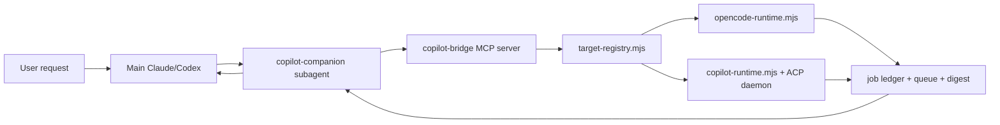

# Agent Companion Architecture

Last updated: 2026-06-19

## Goal

The bridge is no longer Copilot-only. The stable product shape is:

- **MCP outward:** one subagent-only MCP server with generic `agent_*` tools.
- **Target adapters inward:** OpenCode, Copilot, and future targets behind a small runtime boundary.
- **Host isolation unchanged:** main Claude/main Codex never see the bridge tools directly.

## Flow

## Public MCP Surface

Primary tools:

- `agent_send`
- `agent_wait`
- `agent_status`
- `agent_reply`
- `agent_cancel`

Compatibility aliases:

- `copilot_send`
- `copilot_wait`
- `copilot_status`
- `copilot_reply`
- `copilot_cancel`

`copilot_send` is pinned to `target: "copilot"`. Generic `agent_send` accepts optional `target`; callers should treat target choice as explicit or configured. Omitted target resolves from `AGENT_COMPANION_DEFAULT_TARGET`, legacy `COPILOT_COMPANION_DEFAULT_TARGET`, the `default-target` state file, then the current bootstrap fallback `opencode`.

## Target Matrix

| Target | MVP Status | Send | Wait | Status | Cancel | Reply | Restart Resume |
| --- | --- | --- | --- | --- | --- | --- | --- |
| OpenCode | Implemented CLI adapter | yes | yes | yes | yes | no | no |
| Copilot CLI | Existing compatibility adapter | yes | yes | yes | yes | yes | yes with ACP |
| Goose | Planned | no | no | no | no | no | no |
| Aider | Planned | no | no | no | no | no | no |

## Adapter Contract

Current MVP adapters are not yet formal classes. The stable contract is visible through job fields and handlers:

- A target send creates a job with `target`, `jobId`, `task`, `cwd`, `thread`, `mode`, `template`, `parallelStrategy`, `status`, and `startedAt`.
- Terminal adapters call `retainTerminalJob` with `status`, `summary`, `error`, `detail`, `durationMs`, and `terminalAt`.
- `summary.message` is the user-visible terminal message. `summary.toolCalls` is optional.
- Adapters should write or refresh a digest before terminal notification when they have transcript/output material.

## State

State remains under the host-routed companion home:

- `default-model`: Copilot model config.
- `default-target`: generic default target config.
- `threads/`: logical companion thread names.
- `threads/by-host-session/`: Codex host-session to companion-thread mapping.
- `jobs/`: persisted in-flight/recent jobs for restart recovery.
- `runtime/`: logs, queue, prompt streams, and digests.

## Known Compatibility Choices

- The MCP server name remains `copilot-bridge` for install compatibility.
- Digest URIs remain `copilot-digest://<jobId>` for compatibility. A generic `agent-digest://` scheme is future cleanup.
- The repo/package/template names remain `copilot-companion` until a deliberate rename/migration is planned.
