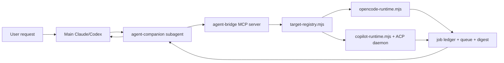

# Agent Companion Architecture

Last updated: 2026-06-19

## Goal

The bridge is no longer Copilot-only. The stable product shape is:

- **MCP outward:** one subagent-only MCP server with generic `agent_*` tools.
- **Target adapters inward:** OpenCode, Copilot, and future targets behind a small runtime boundary.
- **Host isolation unchanged:** main Claude/main Codex never see the bridge tools directly.

## Flow

## Public MCP Surface

The only tools are the generic `agent_*` set:

- `agent_send`
- `agent_wait`
- `agent_status`
- `agent_reply`
- `agent_cancel`

`agent_send` accepts an optional `target` (`opencode` | `copilot`). When omitted, the target resolves from `AGENT_COMPANION_DEFAULT_TARGET`, then the `default-target` state file. **There is no silent fallback** — if nothing is configured and no `target` is passed, `agent_send` returns a `TARGET_UNCONFIGURED` error pointing at onboarding. There are no legacy `copilot_*` aliases and no legacy env overrides; the rename to the `agent-*` identity is complete.

## Target Matrix

| Target | Status | Send | Wait | Status | Cancel | Reply | Restart Resume |
| --- | --- | --- | --- | --- | --- | --- | --- |
| OpenCode | Implemented CLI adapter | yes | yes | yes | yes | no | no |
| Copilot CLI | Implemented ACP adapter | yes | yes | yes | yes | yes | yes with ACP |
| Goose | Planned | no | no | no | no | no | no |
| Aider | Planned | no | no | no | no | no | no |

## Adapter Contract

Current MVP adapters are not yet formal classes. The stable contract is visible through job fields and handlers:

- A target send creates a job with `target`, `jobId`, `task`, `cwd`, `thread`, `mode`, `template`, `parallelStrategy`, `status`, and `startedAt`.
- Terminal adapters call `retainTerminalJob` with `status`, `summary`, `error`, `detail`, `durationMs`, and `terminalAt`.
- `summary.message` is the user-visible terminal message. `summary.toolCalls` is optional.
- Adapters should write or refresh a digest before terminal notification when they have transcript/output material.

## State

State lives under the host-routed companion home `~/.{claude,codex}/agent-companion/`:

- `default-model`: Copilot model config.
- `default-target`: configured default target (written by onboarding).
- `threads/`: logical companion thread names.
- `threads/by-host-session/`: Codex host-session to companion-thread mapping.
- `jobs/`: persisted in-flight/recent jobs for restart recovery.
- `runtime/`: logs, queue, prompt streams, and digests.

## Naming

The product identity is uniformly `agent-*`, with no backward-compatibility shims:

- MCP server: `agent-bridge`.
- Digest URIs: `agent-digest://<jobId>`.
- Env prefix: `AGENT_COMPANION_*` (and `AGENT_RUNTIME_DIR` / `AGENT_BRIDGE_LOG_FILE` / `AGENT_DIGEST_DIR` / etc. for runtime paths).
- Repo / package / plugin / subagent / template names: `agent-companion`.

The Copilot *target adapter* keeps its own `copilot-*` identifiers (`copilot-runtime.mjs`, `copilot-acp-daemon`, `COPILOT_BIN`, `COPILOT_RUNTIME_ADAPTER`, the `~/.copilot/agents/reviewer.agent.md` reviewer) — those name the Copilot target, not the product.
