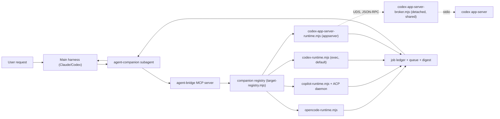

# Agent Companion Architecture

Last updated: 2026-08-11

## Goal

Agent Companion is organized around a harness + companion model:

- **Harnesses outward:** Claude Code and Codex CLI install surfaces today; future
  harnesses should plug in at the host/template/hook/session-routing boundary.
- **MCP middle:** one subagent-only MCP server with generic `agent_*` tools.
- **Companion adapters inward:** OpenCode, Copilot, Codex, and future companions
  behind a small runtime boundary.
- **Strength routing:** installs can expose strengths to the harness while the
  bridge maps each strength to one configured companion profile (see
  `profiles.json` and `resolveRouting`).
- **Harness isolation unchanged:** main Claude/main Codex never see the bridge
  tools directly.

## Product Vocabulary

| Product term | Current implementation term | Meaning |
| --- | --- | --- |
| Harness | host | Parent coding-agent surface, currently Claude Code or Codex CLI. |
| Companion | target | Downstream agent runtime, currently OpenCode, GitHub Copilot CLI, or Codex CLI. |
| Companion profile | `profiles.json` entry | A configured runtime/model instance, such as a Copilot model profile or OpenCode provider/model profile. |
| Strength | `agent_send({ strength })` | A public capability label such as `reviewer`, `web_researcher`, `planner`, or `fast_executor`. |

The current public flags and schema keep `host` and `target` for compatibility:
`setup.sh --host claude|codex|both` selects harness surfaces, and
`agent_send({ target })` or `default-target` selects today's companion runtime.

## Flow


```mermaid
flowchart LR
  User["User request"] --> Main["Main harness (Claude/Codex)"]
  Main --> Subagent["agent-companion subagent"]
  Subagent --> MCP["agent-bridge MCP server"]
  MCP --> Registry["companion registry (target-registry.mjs)"]
  Registry --> OpenCode["opencode-runtime.mjs"]
  Registry --> Copilot["copilot-runtime.mjs + ACP daemon"]
  Registry --> CodexRuntime["codex-runtime.mjs (exec, default)"]
  Registry --> CodexAppServer["codex-app-server-runtime.mjs (appserver)"]
  CodexAppServer -.->|"UDS, JSON-RPC"| Broker["codex-app-server-broker.mjs (detached, shared)"]
  Broker -.->|"stdio"| AppServer["codex app-server"]
  OpenCode --> Job["job ledger + queue + digest"]
  Copilot --> Job
  CodexRuntime --> Job
  CodexAppServer --> Job
  Job --> Subagent
  Subagent --> Main
```

The dotted edges are the ones that survive a bridge replacement. Everything else in this
diagram dies with the bridge process, which is the whole reason the broker exists.

## Public MCP Surface

The only tools are the generic `agent_*` set:

- `agent_send`
- `agent_wait`
- `agent_status`
- `agent_reply`
- `agent_cancel`

`agent_send` accepts an optional `target` (`opencode` | `copilot` | `codex`). When
omitted, the target resolves from `AGENT_COMPANION_DEFAULT_TARGET`, then the
`default-target` state file. **There is no silent fallback** — if nothing is
configured and no `target` is passed, `agent_send` returns a
`TARGET_UNCONFIGURED` error pointing at onboarding. There are no legacy
`copilot_*` aliases and no legacy env overrides; the rename to the `agent-*`
identity is complete.

## Companion Matrix

| Companion | Status | Send | Wait | Status | Cancel | Reply | Restart Resume |
| --- | --- | --- | --- | --- | --- | --- | --- |
| OpenCode (cli) | Implemented CLI adapter (default) | yes | yes | yes | yes | no | no |
| OpenCode (server) | Implemented HTTP server adapter | yes | yes | yes | yes | yes | yes |
| Copilot CLI | Implemented ACP adapter | yes | yes | yes | yes | yes | yes with ACP |
| Codex CLI (exec) | Implemented `codex exec` adapter (default, send-only) | yes | yes | yes | yes | no | no |
| Codex CLI (app-server) | Implemented broker + JSON-RPC adapter | yes | yes | yes | yes | yes | yes |
| Goose | Planned | no | no | no | no | no | no |
| Aider | Planned | no | no | no | no | no | no |

The OpenCode adapter is selected by `OPENCODE_RUNTIME_ADAPTER` (`cli` default,
`server` opt-in), mirroring how Copilot selects `acp`/`sdk`. Server mode drives a
single detached `opencode serve` and roots each job's session at its own `cwd`
via the `?directory=` query param; terminal detection consumes the directory-
scoped `/event` SSE stream (`session.idle` is the per-turn terminal marker) with a
`/session/status` + transcript level-check as the resume/stream-drop backstop. A
job records the adapter it started with (`opencodeAdapter`), and per-job
`reply_available` / `resume_available` flags on the status response report what
that specific job can do — independent of the current env.

The Codex adapter is selected the same way, by `CODEX_RUNTIME_ADAPTER` (`exec`
default, `appserver` opt-in), and records `codexAdapter` on the job for the same
reason. `appserver` mode talks JSON-RPC over a unix socket to a **detached,
machine-wide broker** that owns one `codex app-server` over stdio. The broker
exists because `codex app-server` dies with its stdio parent (measured): the
transport buys nothing on its own, so the survival property comes from the broker
being long-lived and detached from every bridge. Reply is `turn/steer` (real
mid-flight injection, no restart), cancel is `turn/interrupt` (the thread stays
live), restart resume is `thread/resume` (which rejoins a *running* thread), and
salvage is `thread/read` over RPC. `approvalPolicy` is pinned to `never` and is
not configurable — a client that accepts one approval escalates past the sandbox
(measured) — so the sandbox is the hard boundary. Two reapers stop the broker
when nothing is using it: its own inactivity timer and the bridge-side lease
reaper in `lib/shared-runtime-registry.mjs`, both gated on `thread/loaded/list`
rather than on a pid.

The one capability the transport does **not** change is the sandbox: both codex
adapters resolve it from the same `AGENT_COMPANION_CODEX_SANDBOX_MODE`, and the
app-server sends it on `thread/resume` as well as `thread/start` (omitting it
there silently de-escalates a resumed turn — measured on the exec transport).

## Routing Contract

`agent_send` is routed by the sole routing brain `resolveRouting({target,
profile, strength})` (`bridge-server/server.mjs`). A harness picks **at most one
of** `profile` or `strength`; an explicit `target` may co-exist as a refinement.

1. A harness asks the `agent-companion` subagent to send work, naming a
   **strength** (preferred), a **profile** id, or a bare `target`.
2. `resolveRouting` resolves exactly one profile from `profiles.json`, applies a
   pre-spawn capability gate (model/adapter validity), and returns the backing
   `{companion, model, adapter}`.
3. The resolved adapter owns that job until terminal status.

No silent fallback: an unresolvable or ambiguous request returns an explicit
`ok:false` envelope that echoes the candidate ids (`STRENGTH_UNCONFIGURED`,
`STRENGTH_AMBIGUOUS`, `PROFILE_UNKNOWN`, `PROFILE_AMBIGUOUS`, `ROUTING_CONFLICT`,
`CAPABILITY_UNAVAILABLE`), mirroring the existing `TARGET_UNCONFIGURED` posture.

The invariant is two-sided, and the subagent half is the one that broke in the
field: on any of those codes the companion subagent must return the error
envelope and **stop**. It may not re-send with a `target`, `profile`, or
`strength` the harness did not supply. A bridge that refuses to guess is worth
nothing if the layer above it guesses instead — observed once as a
`STRENGTH_UNCONFIGURED` rejection re-sent 30s later against an unnamed target.
Both agent templates carry the prohibition, and both template test suites assert
it.

When no `profiles.json` exists, the bridge synthesizes a single degenerate
profile from `default-target` / `default-model`, so a legacy one-to-one install
routes byte-identically (same job object, same `<thread>.sid` filename).

## Strength Router

Users configure multiple companion profiles — including multiple model profiles
from the same runtime — in `$BASE_DIR/profiles.json`, and assign strengths to
those profiles. Harnesses see only the strength names (via `agent_status`); they
never need to know whether a strength is backed by Copilot, OpenCode, another
companion, or a specific model behind one of them.

```jsonc
{
  "profiles": [
    { "id": "cop-review",  "companion": "copilot",  "model": "claude-sonnet-4.6",            "strengths": ["reviewer", "planner"] },
    { "id": "cop-fast",    "companion": "copilot",  "model": "claude-haiku-4.5",             "strengths": ["fast_executor"] },
    { "id": "oc-research", "companion": "opencode", "model": "anthropic/claude-sonnet-4.6", "adapter": "server", "strengths": ["web_researcher"] }
  ],
  "defaultProfile": "cop-review"
}
```

A profile **inherits** its companion's capabilities (it never re-declares
capability booleans); model is a per-prompt argument, so two profiles differing
only by model reuse the same detached server. Multiple profiles may declare the
same strength — the top-level `defaultProfile` breaks the tie **only if it itself
declares that strength**, otherwise the send returns `STRENGTH_AMBIGUOUS`.
Authoring is non-interactive: `node scripts/onboard.mjs --define-profile <id>
--companion <c> [--model <m>] [--adapter <that companion's transport: opencode
cli|server, codex exec|appserver>] [--strength <labels>]`,
`--assign-strength`, `--set-default-profile`, and `--list-profiles`. Only ids,
model names, and strength labels are persisted — never secrets.

The router is capability-driven: a strength label never implies a capability the
backing profile lacks, and the design avoids assuming every companion supports
reply, resume, parallelism, streaming, or model selection.

## Companion Adapter Contract

Current MVP adapters are not yet formal classes. The stable contract is visible through job fields and handlers:

- A companion send creates a job with `target`, `jobId`, `task`, `cwd`,
  `thread`, `mode`, `template`, `parallelStrategy`, `status`, and `startedAt`.
- Terminal adapters call `retainTerminalJob` with `status`, `summary`, `error`, `detail`, `durationMs`, and `terminalAt`.
- `summary.message` is the user-visible terminal message. `summary.toolCalls` is optional.
- Adapters should write or refresh a digest before terminal notification when they have transcript/output material.

## State

State lives under the host-routed companion home `~/.{claude,codex}/agent-companion/`:

- `default-model`: Copilot model config.
- `default-target`: configured default target (written by onboarding).
- `threads/`: logical companion thread names.
- `threads/by-host-session/`: Codex host-session to companion-thread mapping.
- `jobs/`: persisted in-flight/recent jobs for restart recovery. OpenCode
  server jobs persist their `ses_` session id (under the target-neutral
  `companionSessionId` key) and the server `baseUrl` so a respawned bridge can
  resume them.
- `runtime/`: logs, queue, prompt streams, and digests.
- `runtime/opencode-servers.json`: registry of the shared detached
  `opencode serve` process so a respawned bridge reattaches instead of
  re-spawning.
- `runtime/codex-app-server.sock`: the codex broker's unix socket. Its path is
  fixed and short on purpose — unix paths truncate silently at `SUN_LEN`
  (~104 bytes on darwin). **Socket presence is not liveness:** SIGKILL skips the
  broker's unlink handler, so every start connect-probes the path and treats
  `ECONNREFUSED` as the only safe-to-unlink verdict.
- `runtime/codex-broker.json`: leases, `lastUsedAt` and the two-phase disposal
  claim for that broker. Unlike the OpenCode registry — which holds the only
  record of an ephemeral `--port 0` address — this file is bookkeeping, not an
  address book: the socket path above is a constant, so a bridge that loses it
  simply re-adopts the broker by probing.

## Negative Results

Things that are **not** true, that a reader of this repo would reasonably assume are.
Each was believed here at some point and overturned by measurement; the plan that
records the experiments is [`RELIABILITY_REMEDIATION.md`](RELIABILITY_REMEDIATION.md)
and the harnesses are in [`probes/`](../probes/README.md). They are listed as negatives
because the cost of re-deriving them is a day each.

**Transport and process lifetime**

- **"`codex exec resume` cannot reattach to an in-flight turn"** — true of the **exec
  CLI**, and false of **codex**. `codex app-server`'s `thread/resume` explicitly rejoins
  a *running* thread: a turn was driven to completion across a client that was SIGKILLed
  mid-turn, same `turnId` throughout, zero re-prompting. The limits the exec adapter
  reports are transport limits, and `lib/target-registry.mjs` says so.
- **`detached: true` is not what makes a child survive.** File-backed stdout is
  (2×2 matrix against the real binary). The orphan risk belongs to *"the child's stdout is
  no longer a live bridge pipe"* — so any change that hands codex a file or `'ignore'`, or
  stops draining the pipe, ships an orphan with nobody deciding to.
- **No signal reaches a codex child when its bridge dies.** Disposing a stdio MCP server
  sends SIGINT **to that process only**; a non-detached grandchild is never signalled and
  dies of EPIPE at its next stdout write (measured 1 ms for a 1 Hz writer, 56 s for a turn
  that writes rarely). "Alive" from a pid probe therefore describes a window of seconds,
  which is why the app-server path uses `thread/loaded/list` instead.
- **`codex app-server` over stdio buys no survival by itself.** Spawned as a bridge child
  it dies with its stdio parent and the turn ends `turn_aborted`. The **broker** buys the
  survival, not the protocol.
- **A present socket is not a live broker.** SIGKILL skips the unlink handler. Connect-probe;
  `ECONNREFUSED` is the safe-to-unlink verdict.
- **`thread not found` does not mean the thread is gone.** It means "not loaded into this
  process", and `thread/resume` fixes it. Classifying it as unrecoverable would report a
  broker restart — the exact case this transport was chosen for — as lost work. The guard is
  structural: resume before interrupting or steering a thread this connection did not start.
- **`turn/start` on a busy thread does not reject.** It succeeds and returns a *second*
  turn id: two turns, two bills, two sets of edits. Status must be checked first.

**Host budgets and observability**

- **"The 600 s figure appears nowhere in this repo"** — it did, in `server.mjs`'s own header,
  and it was wrong. The budget that bounds a wait is the MCP **tool idle** timeout: the
  stdio default is **1,800,000 ms** (30 min) polled on a 30 s tick, satisfied by each
  `agent_wait` *returning*, not by any mid-call emission. So `clampWaitSec`'s 1200 s ceiling
  has 600 s of headroom — never raise it past 1500 s without a per-server `timeout`.
- **`env: { MCP_TOOL_TIMEOUT }` in agent frontmatter is inert.** The variable reaches the
  bridge child; the host ignores it. The fields that work are a sibling `timeout` (Claude,
  milliseconds) and `tool_timeout_sec` (Codex, seconds).
- **MCP progress notifications are not a model channel.** They *do* reset the idle watchdog
  (a 70 s silent call aborts; the same call with progress completes), but on this host the
  payload lands in the TUI spinner and the model never sees it.
- **A digest is not a salvage artefact on the exec transport.** Codex emits its substance as
  one atomic message at turn end; an aborted job's digest holds ~0.2 % of the work product.
  On the app-server transport `thread/read` is the salvage channel — and it returns
  **messages only**, no tool activity, though the rollout for the same thread has both.
- **`--output-last-message` is not a salvage channel.** It is never written on SIGTERM or
  `turn.failed`. The ThreadEvent stream likewise emits **no abort marker** on SIGTERM, and
  `codex exec --json` silently omits some `command_execution` items the rollout records.
- **`setTimeout` is already a correct wall deadline across suspend on macOS** — libuv uses
  `mach_continuous_time()`, which counts sleep. Linux's `CLOCK_MONOTONIC` does not, so the
  two platforms have *opposite* semantics and ubuntu CI cannot exercise production behaviour
  even in principle. That, not flakiness, is why durations go through an injectable clock.

**Blast radius**

- **The bridge runs no git and writes nothing inside a job's cwd.** A repo index that moved
  during a delegated job was moved by something else. (Note for future fingerprinting: a bare
  `git status` rewrites `.git/index` to refresh the stat cache.)
- **`handleStatus` performs no lifecycle mutation.** Both hydrate and host-sid adoption are
  latched, so a status call on an already-adopted bridge re-runs nothing. Status was blamed
  for killing jobs; what kills them is a *companion subagent returning*, because overlapping
  subagents share one bridge process that is SIGINT'd when the first of them finishes.
  Status is only special because it is the fastest thing that can finish.
- **Auto-accepting an approval defeats the sandbox.** A `read-only` thread that accepted one
  approval **wrote a file**. Under `approvalPolicy: 'never'` no approval request is ever sent
  and the sandbox is authoritative — which is why the app-server adapter pins it structurally
  rather than exposing it as a setting.
- **The agent file must be materialized into `~/.claude/agents/`.** Plugin subagents silently
  lose `mcpServers` / `hooks` / `permissionMode`.
- **Config inheritance works — do not pin the model.** With no `model`, `turn_context` records
  exactly `~/.codex/config.toml`'s model and effort. Passing `model: null` is *not* the same
  as omitting the key.

## Naming

The product identity is uniformly `agent-*`, with no backward-compatibility shims:

- MCP server: `agent-bridge`.
- Digest URIs: `agent-digest://<jobId>`.
- Env prefix: `AGENT_COMPANION_*` (and `AGENT_RUNTIME_DIR` / `AGENT_BRIDGE_LOG_FILE` / `AGENT_DIGEST_DIR` / etc. for runtime paths).
- Repo / package / plugin / subagent / template names: `agent-companion`.

The Copilot *companion adapter* keeps its own `copilot-*` identifiers
(`copilot-runtime.mjs`, `copilot-acp-daemon`, `COPILOT_BIN`,
`COPILOT_RUNTIME_ADAPTER`, the `~/.copilot/agents/reviewer.agent.md` reviewer)
— those name the Copilot companion, not the product.
