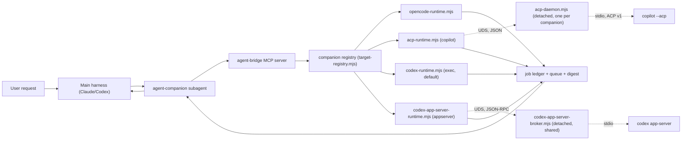

# Agent Companion Architecture

Last updated: 2026-09-11

## Goal

Agent Companion is organized around a harness + companion model:

- **Harnesses outward:** Claude Code and Codex CLI install surfaces today; future
  harnesses should plug in at the host/template/hook/session-routing boundary.
- **MCP middle:** one subagent-oriented MCP server with generic `agent_*` tools.
- **Companion adapters inward:** OpenCode, Copilot, Codex, and future companions
  behind a small runtime boundary.
- **Strength routing:** installs can expose strengths to the harness while the
  bridge maps each strength to one configured companion profile (see
  `profiles.json` and `resolveRouting`).
- **Harness scope is explicit:** Claude keeps the bridge agent-local. Codex
  registers it at plugin/session scope so its agent role can inherit it; direct
  parent use is unsupported even though main Codex can see the tool schemas.

## Product Vocabulary

| Product term | Current implementation term | Meaning |
| --- | --- | --- |
| Harness | host | Parent coding-agent surface, currently Claude Code or Codex CLI. |
| Companion | target | Downstream agent runtime, currently OpenCode, GitHub Copilot CLI, or Codex CLI. |
| Companion profile | `profiles.json` entry | A configured runtime/model instance, such as a Copilot model profile or OpenCode provider/model profile. |
| Strength | `agent_send({ strength })` | A public capability label such as `reviewer`, `web_researcher`, `planner`, or `fast_executor`. |

The current public flags and schema keep `host` and `target` for compatibility:
`setup.sh --host claude|codex|both` selects harness surfaces, and
`agent_send({ target })` still names a companion runtime directly, with
`default-target` behind it as the pre-profile default (see Public MCP Surface).

## Flow


```mermaid
flowchart LR
  User["User request"] --> Main["Main harness (Claude/Codex)"]
  Main --> Subagent["agent-companion subagent"]
  Subagent --> MCP["agent-bridge MCP server"]
  MCP --> Registry["companion registry (target-registry.mjs)"]
  Registry --> OpenCode["opencode-runtime.mjs"]
  Registry --> Acp["acp-runtime.mjs (copilot)"]
  Registry --> CodexRuntime["codex-runtime.mjs (exec, default)"]
  Registry --> CodexAppServer["codex-app-server-runtime.mjs (appserver)"]
  Acp -.->|"UDS, JSON"| Daemon["acp-daemon.mjs (detached, one per companion)"]
  Daemon -.->|"stdio, ACP v1"| Agent["copilot --acp"]
  CodexAppServer -.->|"UDS, JSON-RPC"| Broker["codex-app-server-broker.mjs (detached, shared)"]
  Broker -.->|"stdio"| AppServer["codex app-server"]
  OpenCode --> Job["job ledger + queue + digest"]
  Acp --> Job
  CodexRuntime --> Job
  CodexAppServer --> Job
  Job --> Subagent
  Subagent --> Main
```

The dotted edges are the ones that survive a bridge replacement. Everything else in this
diagram dies with the bridge process, which is the whole reason the broker and the ACP
daemons exist.

### MCP registration boundary

Claude's materialized Markdown agent owns an inline MCP server, so main Claude
does not receive the bridge tools. Codex applies a bounded role overlay and
intentionally rejects `mcp_servers` from a custom agent role: a child may
inherit its parent's authority but may not expand it. The Codex-only plugin
manifest therefore registers `agent-bridge` at session scope, and the
`agent-companion` child inherits it. This makes the schemas visible to main
Codex; the role remains the only supported caller. A root `.mcp.json` is not
used because this repository is also a Claude plugin root. Codex sanitizes the
raw hyphenated server id into the model-visible namespace
`mcp__agent_bridge__*`, exposed as a deferred tool through `functions.exec`;
Claude's agent-local registration retains
`mcp__agent-bridge__*`. The Codex manifest declares the internal tools
pre-approved so an inherited call works under headless approval policy
`never`; user and managed plugin policy may still restrict it.

## Public MCP Surface

The only tools are the generic `agent_*` set:

- `agent_send`
- `agent_wait`
- `agent_status`
- `agent_reply`
- `agent_cancel`

`agent_send` accepts an optional `target` (`opencode` | `copilot` | `codex`).
When it is omitted, resolution starts at the default **profile**
(`AGENT_COMPANION_DEFAULT_PROFILE`, else `profiles.json`'s `defaultProfile`) and
routes to that profile's companion; a default profile that names no configured
profile fails loudly with `PROFILE_UNKNOWN` rather than falling through to a
target. Only when no default profile is configured does resolution fall back to
`AGENT_COMPANION_DEFAULT_TARGET`, then the `default-target` state file. With no
`profiles.json` the bridge synthesizes its one profile from `default-target`, so
a legacy install resolves identically either way. **There is no silent
fallback** — if nothing is configured and no `target` is passed, `agent_send`
returns a `TARGET_UNCONFIGURED` error pointing at onboarding. There are no legacy
`copilot_*` aliases and no legacy env overrides; the rename to the `agent-*`
identity is complete.

## Companion Matrix

| Companion | Status | Send | Wait | Status | Cancel | Reply | Restart Resume |
| --- | --- | --- | --- | --- | --- | --- | --- |
| OpenCode (cli) | Implemented CLI adapter (default) | yes | yes | yes | yes | no | no |
| OpenCode (server) | Implemented HTTP server adapter | yes | yes | yes | yes | yes | yes |
| Copilot CLI | Implemented ACP adapter (generic daemon, Copilot descriptor) | yes | yes | yes | yes | yes (cancel + re-prompt) | yes with ACP |
| Codex CLI (exec) | Implemented `codex exec` adapter (default, send-only) | yes | yes | yes | yes | no | no |
| Codex CLI (app-server) | Implemented broker + JSON-RPC adapter | yes | yes | yes | yes | yes | yes |
| Google Antigravity | Implemented ACP adapter (generic daemon, Antigravity descriptor; spawns the registry's `agy_acp_server.par`) | yes | yes | yes | yes | yes (cancel + re-prompt) | yes with ACP and `session/load` |
| Goose | Planned — an ACP row, a descriptor away | no | no | no | no | no | no |

Aider was dropped from the plan (2026-09-09 assessment: stalled upstream, no ACP
or MCP surface). Gemini CLI was built on the generic daemon and dropped before
shipping (2026-09-11): consumer "Login with Google" ended on 2026-06-18. The
same day Google's own ACP server for Antigravity — the registry's
`antigravity-acp`, published by Google on 2026-08-20 — became the second ACP
companion; the `agy` CLI itself still has no ACP mode. `docs/MVP_TRACKER.md`
items 7 and 8 keep the measurements, the terms reading and the handoff.

The ACP transport is one daemon implementation, `scripts/acp-daemon.mjs`, run
as **one detached process per ACP companion per host home**
(`--companion copilot|antigravity`; `scripts/copilot-acp-daemon.mjs` is the
Copilot binding of the same classes, and `test/fake-acp-agent.mjs` carries the
neutral descriptor the suites drive it with). Each daemon owns one agent child
over stdio — `copilot --acp`, or Google's `agy_acp_server.par` launched bare as
the registry launches it; stdio is the only stable ACP transport — and one socket, log and prompt-stream
namespace (`runtime/<companion>-acp.sock`, `<companion>-acp-daemon.log`,
`prompts/<companion>-acp-<promptId>.jsonl`), and is recorded in
`runtime/acp-daemons.json` through `lib/shared-runtime-registry.mjs` with
leases, `lastUsedAt` and the two-phase disposal claim; the bridge's GC tick is
the second reaper beside the daemon's own inactivity timer, as for the broker.
Everything companion-shaped is the descriptor's `acp` block in
`lib/target-registry.mjs` — spawn argv, extra env, files rotated at spawn,
`clientInfo.name`, default model, whether `session/load` is honoured, the
answer to `session/request_permission`, the usage reader, the
`session/update` kinds the agent was measured to emit (an undeclared kind is
logged once as drift and still parsed) and, for an agent that takes its model
per session rather than as a spawn flag, the request that sets it
(`acp.setModel`: Antigravity's `session/set_config_option`, sent after
`session/new` and again after `session/load`, because a loaded session comes
back on the default model — measured). The daemon pins ACP **v1** at
`initialize`; an agent answering any other version is refused — child killed,
prompt failed `ACP_PROTOCOL_MISMATCH`, job settled `unreachable` with
`detail: acp_protocol_mismatch` — never adapted, because the v2 draft renames
`session/load` to `session/resume`. Reply is cancel + re-prompt on the same
session (ACP has no mid-turn steer, and the acknowledgement says so); restart
resume is the daemon outliving the bridge, plus `session/load` for a session
the daemon no longer holds when the descriptor declares `acp.loadSession` AND
the agent advertises it (Copilot's declares false: process-local sessions;
Antigravity's declares true: its sessions are SQLite files under
`~/.gemini/antigravity-acp/conversations/` and a loaded one remembers,
measured). The daemon answers `session/request_permission` itself, from the descriptor's
policy, because an unattended client that leaves a permission request pending
has hung the agent.

The OpenCode adapter is selected by `OPENCODE_RUNTIME_ADAPTER` (`cli` default,
`server` opt-in), mirroring how Copilot selects `acp`/`sdk`. Server mode drives a
single detached `opencode serve` and roots each job's session at its own `cwd`
via the `?directory=` query param; terminal detection consumes the directory-
scoped `/event` SSE stream (`session.idle` is the per-turn terminal marker) with a
`/session/status` + transcript level-check as the resume/stream-drop backstop. A
job records the adapter it started with (`opencodeAdapter`), and per-job
`reply_available` / `resume_available` flags on the status response report what
that specific job can do — independent of the current env.

The Codex adapter is selected the same way, by `CODEX_RUNTIME_ADAPTER` (`exec`
default, `appserver` opt-in), and records `codexAdapter` on the job for the same
reason. `appserver` mode talks JSON-RPC over a unix socket to a **detached,
broker** — one per host home, shared by every bridge on the machine that
resolves to it — that owns one `codex app-server` over stdio. The broker
exists because `codex app-server` dies with its stdio parent (measured): the
transport buys nothing on its own, so the survival property comes from the broker
being long-lived and detached from every bridge. Reply is `turn/steer` (real
mid-flight injection, no restart), cancel is `turn/interrupt` (the thread stays
live), restart resume is `thread/resume` (which rejoins a *running* thread), and
salvage is `thread/read` over RPC. A follow-up send on a thread whose last job
recorded a thread id also goes through `thread/resume` — every app-server send
on an existing thread, not only `review` — and `thread/start` opens only a
thread with no recorded id; a recorded id that fails to resume on a healthy
broker fails the job explicitly and retires the sid rather than opening fresh. `approvalPolicy` is pinned to `never` and is
not configurable — a client that accepts one approval escalates past the sandbox
(measured) — so the sandbox is the hard boundary. Two reapers stop the broker
when nothing is using it: its own inactivity timer and the bridge-side lease
reaper in `lib/shared-runtime-registry.mjs`. `thread/loaded/list` supplies the
candidate ids, but is not itself an activity signal: each reaper reads those
threads with turns included and proceeds only when every one is positively idle
or terminal. Active and unrecognised/unreadable states fail safe and keep the
broker alive.

The app-server executable is selected as a pair before spawn. The configured
`CODEX_BIN`/PATH binary anchors the desired version; `lib/codex-install.mjs`
retains its invoked path, canonical path and stat identity, follows Codex's
resource/canonical-bin/invoked-sibling helper order, and may select the
same-version unquarantined pair extracted under
`$CODEX_HOME/plugins/.plugin-appserver/`. It never alters `/opt/homebrew/bin` or
xattrs; a failed xattr read remains an explicit indeterminate verdict rather
than being collapsed to attribute absence. The broker publishes the selected launch identity on `initialize` and
`broker/status`. Before each send the bridge compares that identity with a
fresh selection; a mismatch or deleted running image is replaced only through
the existing client/lease/active-turn disposal guards. A `thread/start`
configuration `EPERM` or dead-broker signature gets the same guarded replacement
and exactly one retry.

The one capability the transport does **not** change is the sandbox: both codex
adapters resolve it from the same `AGENT_COMPANION_CODEX_SANDBOX_MODE`, and the
app-server sends it on `thread/resume` as well as `thread/start` (omitting it
there silently de-escalates a resumed turn — measured on the exec transport).

## Routing Contract

`agent_send` is routed by the sole routing brain `resolveRouting({target,
profile, strength})` (`bridge-server/server.mjs`). A harness picks **at most one
of** `profile` or `strength`; an explicit `target` may co-exist as a refinement.

1. A harness asks the `agent-companion` subagent to send work, naming a
   **strength** (preferred), a **profile** id, or a bare `target`.
2. `resolveRouting` resolves exactly one profile from `profiles.json`, applies a
   pre-spawn capability gate (model/adapter validity), and returns the backing
   `{companion, model, adapter}`.
3. The resolved adapter owns that job until terminal status.

No silent fallback: a request that is unresolvable, ambiguous, or refused by the
capability gate returns an explicit `ok:false` envelope that names the failure
and, where candidates exist, echoes their ids (`TARGET_UNCONFIGURED`,
`TARGET_UNSUPPORTED`, `STRENGTH_UNCONFIGURED`, `STRENGTH_AMBIGUOUS`,
`PROFILE_UNKNOWN`, `PROFILE_AMBIGUOUS`, `ROUTING_CONFLICT`,
`CAPABILITY_UNAVAILABLE`, `MODEL_NOT_ALLOWED`). The gate refusals
(`TARGET_UNSUPPORTED`, `CAPABILITY_UNAVAILABLE`, `MODEL_NOT_ALLOWED`) have no
candidate list to echo — they name the offending companion in `target` instead,
and `MODEL_NOT_ALLOWED` adds `model` and a `hint`. Every one of them ships in the
`TARGET_UNCONFIGURED` envelope shape, carrying the public `targets` and
`profiles` lists so the harness can see what *is* configured.

The invariant is two-sided, and the subagent half is the one that broke in the
field: on any of those codes the companion subagent must return the error
envelope and **stop**. It may not re-send with a `target`, `profile`, or
`strength` the harness did not supply. A bridge that refuses to guess is worth
nothing if the layer above it guesses instead — observed once as a
`STRENGTH_UNCONFIGURED` rejection re-sent 30s later against an unnamed target.
Both agent templates carry the prohibition, and both template test suites assert
it.

When no `profiles.json` exists, the bridge synthesizes a single degenerate
profile from `default-target` / `default-model`, so a legacy one-to-one install
routes byte-identically (same job object, same `<thread>.sid` filename).

## Strength Router

Users configure multiple companion profiles — including multiple model profiles
from the same runtime — in `$BASE_DIR/profiles.json`, and assign strengths to
those profiles. Harnesses see only the strength names (via `agent_status`); they
never need to know whether a strength is backed by Copilot, OpenCode, another
companion, or a specific model behind one of them.

```jsonc
{
  "profiles": [
    { "id": "cop-review",  "companion": "copilot",  "model": "claude-sonnet-4.6",            "strengths": ["reviewer", "planner"] },
    { "id": "cop-fast",    "companion": "copilot",  "model": "claude-haiku-4.5",             "strengths": ["fast_executor"] },
    { "id": "oc-research", "companion": "opencode", "model": "anthropic/claude-sonnet-4.6", "adapter": "server", "strengths": ["web_researcher"] }
  ],
  "defaultProfile": "cop-review"
}
```

A profile **inherits** its companion's capabilities (it never re-declares
capability booleans); model is a per-prompt argument, so two profiles differing
only by model reuse the same detached server. Multiple profiles may declare the
same strength — the top-level `defaultProfile` breaks the tie **only if it itself
declares that strength**, otherwise the send returns `STRENGTH_AMBIGUOUS`.
Authoring is non-interactive: `node scripts/onboard.mjs --define-profile <id>
--companion <c> [--model <m>] [--adapter <that companion's transport: opencode
cli|server, codex exec|appserver>] [--strength <labels>]`,
`--assign-strength`, `--set-default-profile`, and `--list-profiles`. Only ids,
model names, and strength labels are persisted — never secrets.

The router is capability-driven: a strength label never implies a capability the
backing profile lacks, and the design avoids assuming every companion supports
reply, resume, parallelism, streaming, or model selection.

## Companion Adapter Contract

Current MVP adapters are not yet formal classes. The stable contract is visible through job fields and handlers:

- A companion send creates a job with `target`, `jobId`, `task`, `cwd`,
  `thread`, `mode`, `template`, `parallelStrategy`, `status`, and `startedAt`.
- Terminal adapters call `retainTerminalJob` with `status`, `summary`, `error`, `detail`, `durationMs`, and `terminalAt`.
- `summary.message` is the user-visible terminal message. `summary.toolCalls` is optional.
- Every adapter puts the turn's token usage, when its transport reports one,
  on the summary it builds, in the one shape `lib/usage.mjs` defines (six
  counters, `source`, optional `model`/`cost`/`cost_unit`, `partial` for a
  watch that did not see the turn from its start). `retainTerminalJob` moves it
  to `job.usage` — the ledger, wait `meta.usage`, the queue event,
  `agent_status` and both digests read it from there; nothing reads
  `summary.usage` after the terminal. Absent, never zeroed, when the transport
  reported nothing.
- A completed `review` job also carries `verdict` (`agree` | `disagree` | `null`)
  and `verdictReason` (`missing` | `malformed` | `conflicting` when the verdict
  is null), read once at `retainTerminalJob` from the message's `VERDICT:` line
  (`classifyReviewVerdict`, beside the template in `bridge-server/validation.mjs`)
  and rendered from the job into wait `meta`, the queue event, the body footer
  and the digest. A null verdict never remaps the status: the turn completed;
  the review did not conclude.
- Every `unreachable` result derives one `failure_class` for job status, wait
  metadata and completion notifications. A live Codex `turn/completed` with
  zero observed tool calls is remapped only when its assistant message reports
  a universal pre-execution command blocker. A recovered `thread/read` history
  has no tool record, so only an explicit named-runner-unavailable message is
  remapped. Both become `codex_code_mode_host_unavailable` /
  `runtime_unavailable`; ordinary zero-tool answers stay completed.
- Adapters should write or refresh a digest before terminal notification when they have transcript/output material.

## State

State lives under the host-routed companion home `~/.{claude,codex}/agent-companion/`:

- `default-model`: Copilot model config.
- `default-target`: configured default target (written by onboarding).
- `threads/`: logical companion thread names, each holding the companion
  session the last job on that thread recorded — a Copilot ACP session id, or a
  codex app-server thread id — namespaced by profile. It is what a follow-up
  send resumes. The exec adapter never reads or writes it.
- `threads/by-host-session/`: Codex host-session to companion-thread mapping.
- `jobs/`: persisted in-flight/recent jobs for restart recovery. OpenCode
  server jobs persist their `ses_` session id (under the target-neutral
  `companionSessionId` key) and the server `baseUrl` so a respawned bridge can
  resume them. A settled job carries `usage` (see the adapter contract) — the
  per-job ledger that routing and cost decisions can be judged against.
- `runtime/`: logs, queue, prompt streams, and digests.
- `runtime/opencode-servers.json`: registry of the shared detached
  `opencode serve` process so a respawned bridge reattaches instead of
  re-spawning.
- `runtime/<companion>-acp.sock`: each ACP daemon's unix socket (copilot
  today), a fixed short path like the broker's; `runtime/acp-daemons.json`
  records the daemon's pid, leases, `lastUsedAt` and disposal claim per
  companion — bookkeeping, not an address book, for the same reason as the
  broker's file.
- `runtime/codex-app-server.sock`: the codex broker's unix socket. Its path is
  fixed and short on purpose — unix paths truncate silently at `SUN_LEN`
  (~104 bytes on darwin). **Socket presence is not liveness:** SIGKILL skips the
  broker's unlink handler, so every start connect-probes the path and unlinks
  only on an `absent` verdict — `ECONNREFUSED`, `ENOENT`, or `ENOTSOCK` (a plain
  file left at the path). Any other code, such as `EMFILE` under a wide fan-out
  or `EACCES`, is a probe that failed rather than an answer, and the start
  refuses with `BROKER_SOCKET_INDETERMINATE` instead of guessing.
- `runtime/codex-broker.json`: running launch metadata, leases, `lastUsedAt`
  and the two-phase disposal claim for that broker. Unlike the OpenCode registry
  — which holds the only record of an ephemeral `--port 0` address — this file
  is bookkeeping, not an address book: the socket path above is a constant, so
  a bridge that loses it simply re-adopts the broker by probing.

## Negative Results

Things that are **not** true, that a reader of this repo would reasonably assume are.
Each was believed here at some point and overturned by measurement; the plan that
records the experiments is [`RELIABILITY_REMEDIATION.md`](RELIABILITY_REMEDIATION.md)
and the harnesses are in [`probes/`](../probes/README.md). They are listed as negatives
because the cost of re-deriving them is a day each.

**Transport and process lifetime**

- **"`codex exec resume` cannot reattach to an in-flight turn"** — true of the **exec
  CLI**, and false of **codex**. `codex app-server`'s `thread/resume` explicitly rejoins
  a *running* thread: a turn was driven to completion across a client that was SIGKILLed
  mid-turn, same `turnId` throughout, zero re-prompting. The limits the exec adapter
  reports are transport limits, and `lib/target-registry.mjs` says so.
- **`detached: true` is not what makes a child survive.** File-backed stdout is
  (2×2 matrix against the real binary). The orphan risk belongs to *"the child's stdout is
  no longer a live bridge pipe"* — so any change that hands codex a file or `'ignore'`, or
  stops draining the pipe, ships an orphan with nobody deciding to.
- **No signal reaches a codex child when its bridge dies.** Disposing a stdio MCP server
  sends SIGINT **to that process only**; a non-detached grandchild is never signalled and
  dies of EPIPE at its next stdout write (measured 1 ms for a 1 Hz writer, 56 s for a turn
  that writes rarely). "Alive" from a pid probe therefore describes a window of seconds,
  which is why the app-server path uses `thread/loaded/list` instead.
- **`codex app-server` over stdio buys no survival by itself.** Spawned as a bridge child
  it dies with its stdio parent and the turn ends `turn_aborted`. The **broker** buys the
  survival, not the protocol.
- **A present socket is not a live broker.** SIGKILL skips the unlink handler. Connect-probe;
  only an `absent` verdict — `ECONNREFUSED`, `ENOENT`, `ENOTSOCK` — authorises the unlink. An
  indeterminate code (`EMFILE`, `EACCES`) refuses it, because it says nothing about liveness.
- **`thread not found` does not mean the thread is gone.** It means "not loaded into this
  process", and `thread/resume` fixes it. Classifying it as unrecoverable would report a
  broker restart — the exact case this transport was chosen for — as lost work. The guard is
  structural: resume before interrupting or steering a thread this connection did not start.
- **`turn/start` on a busy thread does not reject.** It succeeds and returns a *second*
  turn id: two turns, two bills, two sets of edits. Status must be checked first.
- **A thread being loaded does not mean it is active.** Completed and interrupted
  threads remain in `thread/loaded/list` for reuse. Treating list length as a
  busy bit kept the 2026-09-02 pre-upgrade broker alive indefinitely. Both
  reapers now read each thread and protect active or unknown state, but allow a
  positively idle/terminal set to retire.
- **An alive broker is not necessarily the installed broker.** A detached
  app-server can keep a deleted Homebrew Caskroom image mapped across
  `brew upgrade codex`. Socket readiness therefore proves transport liveness,
  not executable freshness; version, canonical path and stat identity are
  compared separately before a send.
- **`--code-mode-host` is not a local helper-path override.** In Codex 0.152.x it
  selects a remote HTTP(S)/gRPC endpoint ([source](https://github.com/openai/codex/blob/rust-v0.152.0/codex-rs/app-server/src/code_mode_host.rs#L8-L78)).
  No supported key in the [Codex configuration reference](https://developers.openai.com/codex/config-reference)
  or environment variable redirects a local helper. The
  [local resolver](https://github.com/openai/codex/blob/rust-v0.152.0/codex-rs/install-context/src/lib.rs#L172-L202)
  checks packaged
  resources, the canonical package `bin` directory, then the invoked executable
  directory; selecting a colocated complete Codex/helper pair is the supported
  local mechanism.

**Host budgets and observability**

- **"The 600 s figure appears nowhere in this repo"** — it did, in `server.mjs`'s own header,
  and it was wrong. The budget that bounds a wait is the MCP **tool idle** timeout: the
  stdio default is **1,800,000 ms** (30 min) polled on a 30 s tick, satisfied by each
  `agent_wait` *returning*, not by any mid-call emission. So `clampWaitSec`'s 1200 s ceiling
  has 600 s of headroom — never raise it past 1500 s without a per-server `timeout`.
- **The two Claude Code budget variables, pinned** (docs read 2026-09-11; both names are
  present in the 2.1.268 binary; neither has been set or measured on this host).
  `CLAUDE_CODE_MCP_TOOL_IDLE_TIMEOUT` (v2.1.187+, stdio servers included from v2.1.203) is
  the idle window above, in ms: default 1,800,000 for stdio, 300,000 for HTTP/SSE/WebSocket,
  `0` disables the check. It is a host-shell variable, read where `claude` is launched; an
  `env:` entry on the server reaches only the bridge child, like `MCP_TOOL_TIMEOUT`. The
  default is the measured value, so nothing sets it. The documented interaction that does
  matter: from v2.1.203 a per-server `timeout` of at least 1000 ms also floors the idle
  window for that server, so the frontmatter's `timeout: 1320000` is the one knob the
  templates carry (Codex: `tool_timeout_sec = 1320`). `CLAUDE_CODE_MCP_AUTO_BACKGROUND_MS`
  (v2.1.212+): an MCP call in the **main conversation** still running after 120,000 ms
  becomes a background task and the model receives a task id instead of the result; `0`
  turns it off. The docs exclude subagent calls outright, and every bridge call is made by
  the `agent-companion` subagent, so the blocking `agent_wait` contract stands and the
  bridge sets nothing. The sign that it fired anyway would be a wait answered with a task
  id rather than an envelope — `docs/DIRECTION_ASSESSMENT.md` §7 keeps it on the
  re-verify list.
- **`env: { MCP_TOOL_TIMEOUT }` in agent frontmatter is inert.** The variable reaches the
  bridge child; the host ignores it. The fields that work are a sibling `timeout` (Claude,
  milliseconds) and `tool_timeout_sec` in the Codex plugin manifest (seconds).
- **MCP progress notifications are not a model channel.** They *do* reset the idle watchdog
  (a 70 s silent call aborts; the same call with progress completes), but on this host the
  payload lands in the TUI spinner and the model never sees it.
- **A digest is not a salvage artefact on the exec transport.** Codex emits its substance as
  one atomic message at turn end; an aborted job's digest holds ~0.2 % of the work product.
  On the app-server transport `thread/read` is the salvage channel — and it returns
  **messages only**, no tool activity, though the rollout for the same thread has both.
- **Protocol completion is not always a task verdict.** Codex can emit
  `turn/completed` after its subordinate command runner failed before any command
  executed. Conversely, many valid conversational turns use zero tools and
  restart recovery has no tool history. The bridge therefore requires a live
  `turn/completed`, zero observed tool calls, and a universal pre-execution
  command blocker; for recovered `thread/read`, it requires an explicit
  named-runner-unavailable message instead. Prose merely quoting such an error
  is not enough.
- **`--output-last-message` is not a salvage channel.** It is never written on SIGTERM or
  `turn.failed`. The ThreadEvent stream likewise emits **no abort marker** on SIGTERM, and
  `codex exec --json` silently omits some `command_execution` items the rollout records.
- **`setTimeout` is already a correct wall deadline across suspend on macOS** — libuv uses
  `mach_continuous_time()`, which counts sleep. Linux's `CLOCK_MONOTONIC` does not, so the
  two platforms have *opposite* semantics and ubuntu CI cannot exercise production behaviour
  even in principle. That, not flakiness, is why durations go through an injectable clock.

**Blast radius**

- **The bridge runs no git and writes nothing inside a job's cwd.** A repo index that moved
  during a delegated job was moved by something else. (Note for future fingerprinting: a bare
  `git status` rewrites `.git/index` to refresh the stat cache.)
- **`handleStatus` performs no lifecycle mutation.** Both hydrate and host-sid adoption are
  latched, so a status call on an already-adopted bridge re-runs nothing. Status was blamed
  for killing jobs. On Claude's agent-local MCP lifecycle, overlapping subagents can share one
  bridge process that is SIGINT'd when the first of them finishes; Status is only special
  because it is the fastest thing that can finish. Codex's plugin/session-scoped registration
  does not use that agent-local teardown boundary. Detached companion runtimes remain the
  durability boundary on both hosts.
- **"No thread id" does not mean "broadcast".** The distiller classified every notification
  without a thread id as `global`, and the broker fanned those out to every bridge. Read against
  the codex source (rust-v0.150.1, 2026-08-28): codex has three delivery paths, not two — thread
  subscribers, **one connection** (`send_server_notification_to_connection`), and broadcast —
  and five pinned notifications take the middle one: `mcpServer/event/stream/notification`
  (`subscriptionId`), `command/exec/outputDelta` (`processId`), `process/outputDelta` /
  `process/exited` (`processHandle`), `fs/changed` (`watchId`). Through a broker that owns the
  single connection they are addressed to nobody, and "global" would have handed one job's
  process output or hosted-app events to every other job. They are now a third routing class,
  `connection`: declined at the handshake via `capabilities.optOutNotificationMethods` (honoured
  per connection; unknown capability fields are ignored — both measured) and dropped with a WARN
  if one arrives anyway. Dormant today — `mcpServer/event/stream/*` is `#[experimental]` and the
  broker never opts in; nothing here calls `command/exec`, `process/*` or `fs/watch` — but the
  owner-key rule is a table (`subscriptionId`, `processId`, `processHandle`, `watchId`), not a
  shape heuristic: `sessionId`, `loginId` and `importId` look identical and codex genuinely
  broadcasts those.
- **A superseded broker that never retires is not a reaper bug.** The idle reaper held a
  pre-upgrade broker alive for hours on the machine that ran the test suite, and the cause was
  not in the reaper: `hooks/drain-completions.test.mjs` shelled the hook out with the real
  `$HOME`, so every run of its thirteen tests wrote five fixture-session heartbeats (`sid-A`,
  `sid-B`, `sess_abc_def`, `café-1`, `agent_main_01HX`) into the operator's real
  `runtime/heartbeats/`, and `HOST_LIVENESS_TTL_MS` (30 min) then counted each as a live host.
  Measured 2026-08-28. The suite now sandboxes `AGENT_RUNTIME_DIR` at module level, and the
  guard is structural, not a list: `node --test` sets `NODE_TEST_CONTEXT` in every test child
  and everything a test spawns inherits it, so `lib/host.mjs`'s `refuseRealHomeUnderTest` —
  called from `runtimeDir()`, from `state.mjs`'s `BASE_DIR` at import, and mirrored in
  `hooks/drain-completions.sh` — throws on any path under the real account home
  (`os.userInfo()`, not `$HOME`; anything under `os.tmpdir()` passes). A textual guard over the
  test sources was tried first and had four holes. If a daemon looks immortal, list the
  heartbeats dir before suspecting the reaper.
- **Auto-accepting an approval defeats the sandbox.** A `read-only` thread that accepted one
  approval **wrote a file**. Under `approvalPolicy: 'never'` no approval request is ever sent
  and the sandbox is authoritative — which is why the app-server adapter pins it structurally
  rather than exposing it as a setting.
- **Confining `plan_path` to the plans dir is not a boundary.** An audit finding once had
  `plan_review` reject any plan whose real path fell outside `~/.{claude,codex}/plans`, so a
  symlink there could not point Copilot at `/etc/passwd`. But the path only ever reaches the
  companion *inside a prompt*, and every shipped companion reads the whole filesystem on its
  own (Copilot runs `--allow-all-paths`; codex `workspace-write` confines writes, not reads;
  OpenCode is unsandboxed) — and the caller is the subagent, which has `Bash` and copies the
  file in anyway. Measured 2026-08-28: the check cost one bounced dispatch per scratchpad plan
  plus a duplicate under `~/.claude/plans` that the harness then edited out of sync with the
  copy the companion reviewed. An explicit `plan_path` is now accepted anywhere (still
  absolute, existing, a file, and realpath-canonicalised); the plans dir remains only the
  lookup scope for `plan_path: "latest"`.
- **The agent file must be materialized into `~/.claude/agents/`.** Plugin subagents silently
  lose `mcpServers` / `hooks` / `permissionMode`.
- **A codex version bump is not a wire-contract change.** The contract fixture used to pin
  `codex --version` and fail the drift test on any other version, on the theory that the
  protocol carries no version field so the version string was the only early warning. Measured
  2026-08-28: 0.147.0 → 0.150.1 added 9 notifications, widened enums, added one required
  `Thread` field, and moved nothing — and the pin had turned that into a red build with nothing
  to review, as it would for a pure bug-fix release. The only thing that can say whether an
  upgrade changed the wire is the wire's own schema (`codex app-server generate-json-schema`,
  ~90 ms, ~4 MB), so that is what the drift test and the broker's boot probe compare
  (`compareContracts`), classified with routing moves first. The version is recorded as
  provenance only.
- **Config inheritance works — do not pin the model.** With no `model`, `turn_context` records
  exactly `~/.codex/config.toml`'s model and effort. Passing `model: null` is *not* the same
  as omitting the key.
- **An agent's yolo flag is not yolo.** Measured 2026-09-11 on Gemini CLI 0.59.0 under
  `--acp`, while it was being evaluated as the second companion: "Approval mode
  overridden to \"default\" because the current folder is not trusted", after which
  every edit and shell call arrives as a `session/request_permission` request. A
  client that only passes a flag hangs its agent on the first tool; the generic daemon
  therefore answers the request itself, from the descriptor's policy, whatever any
  flag said.
- **`notifications/initialized` is not ACP.** It is MCP's post-handshake notification;
  the Copilot daemon sent it for a year and Copilot ignored it, but Gemini's SDK
  answers it `-32601 "Method not found"` on stderr. The spec's key for what the client
  can do is `clientCapabilities`, not `capabilities`. Both were corrected in the generic
  daemon and the live Copilot job afterwards was unaffected.
- **Per-turn usage is not on the ACP stream, for either agent measured.** Gemini CLI
  0.59.0 emits no `usage_update`; its turn tokens are on the prompt RESPONSE under
  `_meta.quota.token_count`. Copilot CLI 1.0.83 does emit `usage_update`, and it is the
  protocol's context-occupancy signal (`used`/`size`), not the turn's tokens — the OTEL
  span stays Copilot's source. Google's agy_acp_server 1.1.1 has it nowhere on ACP
  (measured 2026-09-11): the prompt response is `{stopReason}` alone and no
  `usage_update` is emitted; the internal harness's `usageUpdate` frames
  (promptTokenCount, candidatesTokenCount, thoughtsTokenCount) are echoed on its
  stderr log as debug output, which this bridge does not read — Antigravity jobs
  carry no `usage`. The protocol's own `PromptResponse.usage` (six counters)
  is still marked unstable in the v1 schema; a descriptor's `acp.usage` reader is where
  any of these shapes is read.
- **An agent advertising `loadSession: true` does not mean its sessions survive its
  process.** Copilot CLI 1.0.83 advertises it (measured) and its sessions are
  process-local (github/copilot-cli#1767). Which is why `session/load` is a
  descriptor decision (`acp.loadSession`) ANDed with the agent's advertisement, not
  the advertisement alone: Copilot false; the fake agent's descriptor true; Antigravity
  true, and measured to mean it — a fresh `agy_acp_server.par` process loads the id,
  replays twelve updates of history and answers the follow-up from memory.
- **A v2 `initialize` request is answered with `protocolVersion: 1`.** By both agents
  measured (Copilot 1.0.83, Gemini 0.59.0; the spec says an agent answers with the
  latest version it supports), so a client cannot probe for v2 support by asking — and
  the pin can be enforced at the handshake, where refusing costs nothing. Google's
  agy_acp_server 1.1.1 does the opposite: it answers 1 when asked 1 and 2 when asked 2
  (measured 2026-09-11), so a forum report that it "negotiates protocolVersion 2" was
  the client asking for 2. Either way the pin holds at the handshake.
- **Homebrew's `gemini-cli` is not the latest Gemini CLI, and Antigravity CLI is not a
  Gemini CLI with a new name.** The formula is deprecated at 0.46.0 (disabled
  2026-12-18) with the `antigravity-cli` cask as its replacement; npm carries 0.59.0 and
  the ACP registry launches that package. `agy` is a closed-source rewrite with no
  `--acp` (feature request open since 2026-05-20), Google's FAQ forbids "third party
  software, tools, or services" on an Antigravity login and recommends "a Vertex or AI
  Studio API key" for third-party coding agents, and the registry's `antigravity-acp`
  entry is Google's IDE-extension server on that same login. And Gemini CLI itself
  refuses "Login with Google" for individual, AI Pro and AI Ultra accounts since
  2026-06-18 (screenshot evidence, 2026-09-11) — only Code Assist Standard/Enterprise
  licenses and API keys remain. Neither CLI is a companion this bridge can ship.
  **Corrected the same day for the server half:** the registry's `antigravity-acp` is
  Google's own signed server (`agy_acp_server.par`; PR #542 by Google on 2026-08-20,
  bumped to 1.1.1 from a google.com address on 2026-09-03), published to a registry
  whose stated purpose is any client that speaks the protocol; Google's terms and FAQ
  prohibit software that piggybacks on the OAuth token to reach Google's backend, which
  a stdio client of Google's own server does not do. That server is the second ACP
  companion; `agy` still is not. `docs/MVP_TRACKER.md` item 8 carries the quotes, the
  reading and its caveats.
- **A model is not always a spawn flag.** Google's agy_acp_server 1.1.1 takes the model
  as a session config option (`session/set_config_option`, id `model`; `session/set_model`
  answers too) and a `session/load`ed session comes back on the default model (measured
  2026-09-11: set to `gemini-3.8-flash-low`, killed, loaded, `currentValue` back to
  `gemini-3.7-flash-high`). So the descriptor names the request (`acp.setModel`) and the
  daemon sends it after `session/new` and again after `session/load`; an unknown id is
  refused with -32602 naming the available ones and fails the prompt, never a silent
  fallback to the default. Copilot's descriptor has no such hook and its argv is
  unchanged.
- **A codex role file accepting `mcp_servers` does not mean the child gets it.** The Codex
  subagents docs say a custom agent file may declare `mcp_servers`. Read against rust-v0.153.4
  (2026-09-09): the role parser (`codex-rs/agent-roles/src/agent_role_config.rs`) flattens the
  whole `ConfigToml` into the role file, so `[mcp_servers.x]` is accepted without error — and
  `codex-rs/core/src/agent/role.rs`'s `apply_role_to_config_inner` then copies a closed list
  (developer_instructions, model, reasoning effort/summary/verbosity, personality,
  service_tier, features, skills) and drops `mcp_servers` on the floor. A role-local bridge
  registration would be a silent no-op, which is worse than the rejection it replaced. The
  plugin-manifest session-scope registration stays; `templates/agent-companion.toml.test.mjs`
  asserts the role carries no `[mcp_servers]`. Re-check `apply_role_to_config_inner` on every
  codex upgrade — the day it honours the key, the Codex host can go agent-local like Claude.

## Codex Upgrade Incident Evidence (2026-09-02)

Root-caused from process/file inspection, persisted jobs and upstream Codex
source:

- The detached broker deliberately outlived its launching terminal and still
  had the removed 0.151.0 Caskroom image mapped after the upgrade. Its previous
  health check proved only socket/app-server readiness, and terminal loaded
  threads prevented the old reaper from retiring it. The replacement logic now
  checks executable identity and actual turn activity.
- The affected local 0.152.0 payload had no `codex-code-mode-host`. Codex's
  resolver consequently reached its final invoked-directory candidate,
  `/opt/homebrew/bin/codex-code-mode-host`, which Homebrew had not installed.
  There is no local helper-path setting to inject instead.
- Job `codex-mtjptuj4-89gw` persisted `completed` even though its terminal text
  said every command failed before execution and explicitly withheld a review
  verdict. The bridge had accepted protocol completion without interpreting the
  narrowly identifiable runtime blocker; that propagation defect is now
  normalized before persistence and notification.

Evidence boundaries retained as inference or unknown:

- The configuration `EPERM` is consistent with macOS Files-and-Folders/TCC's
  [responsible-code model](https://developer.apple.com/forums/thread/125438)
  losing its original process context after a detached broker
  outlives the terminal, but the incident's responsible audit token was not
  recoverable. The bridge treats that exact `thread/start` signature as
  recoverable once; it does not claim the OS mechanism was proven.
- The user's controlled A/B established that removing quarantine from the cask
  parent and restarting stopped the Gatekeeper dialog, while changing the helper
  did not. The exact Gatekeeper responsibility/inheritance mechanism remains an
  inference, so quarantine is detected and surfaced rather than rewritten.
  There is no install-time pre-emption either: Homebrew removed `--no-quarantine`
  (Homebrew/brew#20755, closed 2025-11-05; brew 6.0.22 lists no such option and
  `HOMEBREW_CASK_OPTS` would fail on it), so the attribute returns with every
  cask upgrade and the doctor and inspector warnings name the operator's
  `xattr -d` as the remedy (checked 2026-09-11).
- The currently published [0.152.0](https://github.com/openai/codex/releases/tag/rust-v0.152.0)
  and [0.152.1](https://github.com/openai/codex/releases/tag/rust-v0.152.1)
  package archives both contain the helper and use the same lookup
  implementation. Why the historical local
  0.152.0 payload lacked it is not established; 0.152.1 must not be described as
  an upstream helper-lookup fix.

## Naming

The product identity is uniformly `agent-*`, with no backward-compatibility shims:

- MCP server: `agent-bridge`.
- Digest URIs: `agent-digest://<jobId>`.
- Env prefix: `AGENT_COMPANION_*` (and `AGENT_RUNTIME_DIR` / `AGENT_BRIDGE_LOG_FILE` / `AGENT_DIGEST_DIR` / etc. for runtime paths).
- Repo / package / plugin / subagent / template names: `agent-companion`.

The Copilot *companion adapter* keeps its own `copilot-*` identifiers
(`copilot-acp-daemon.mjs` — the Copilot binding of the generic daemon —
`copilot-acp.sock`, `COPILOT_BIN`, `COPILOT_RUNTIME_ADAPTER`, the
`~/.copilot/agents/reviewer.agent.md` reviewer) — those name the Copilot
companion, not the product. The generic pieces are `acp-*`
(`scripts/acp-daemon.mjs`, `bridge-server/acp-runtime.mjs`,
`runtime/<companion>-acp.sock`, `AGENT_ACP_DAEMON_PATH`).
